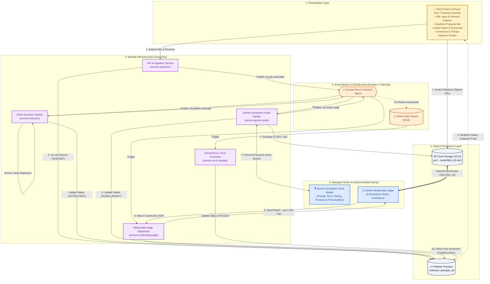

# Product Requirements Document (PRD)
## Project: Knowledge Article to Human-Like Speech & Multimodal LLM-as-a-Judge Platform

---

## 1. Problem Statement

Enterprise knowledge articles, technical support documentation, and customer guides are authored strictly for visual consumption on screens, not for the human ear. When organizations attempt to make this content accessible via audio using standard Text-to-Speech (TTS) solutions, they encounter critical barriers:

1. **Unnatural and Monotonous Delivery:** Direct text-to-speech reading sounds mechanical, robotic, and flat. Standard TTS engines read written prose without natural conversational transitions, leading to rapid listener fatigue.
2. **Missing Speech Prosody & Emotional Cadence:** Written documentation lacks speech-based nuances (e.g., breathing intervals, rhetorical pauses, emphasis on key concepts, and pacing shifts when explaining technical complexity).
3. **Mispronounced Acronyms & Domain Jargon:** Industry terminology, acronyms (e.g., "mTLS", "PPM", "gRPC", "OAuth"), mathematical units, and code snippets are frequently garbled or read phonetically incorrect by default speech engines.
4. **Brittle SSML Maintenance Overheads:** Traditional approaches rely on manual or rule-based SSML tagging (`<break>`, `<prosody>`, `<sub alias="...">`). Maintaining rigid XML schemas across thousands of articles is fragile, labor-intensive, and prone to parsing errors.
5. **Streaming Latency & Timeout Vulnerabilities:** Real-time chunk streaming over HTTP connections frequently breaks or times out on long-form articles, resulting in poor user experience and wasted compute.
6. **Absence of Objective Quality Auditing:** Content curators currently have no automated method to verify whether synthesized voice output meets enterprise standards for naturalness, clarity, and brand tone before delivering it to customers.
7. **Lack of Telemetry & Process Traceability:** Teams lack centralized records documenting *what was processed* (source URL, extracted text, injected persona directives) versus *what the result was* (generated audio asset, quality scorecard, cost per article), making continuous improvement and FinOps impossible.

---

## 2. Solution & System Architecture

An automated, serverless, **Event-Driven Architecture (EDA)** built on **Google Cloud Platform (GCP)** that ingests knowledge article URLs, extracts clean text, uses the **Gemini Model Family (Vertex AI)** for direct generative voice synthesis with prompt-guided personas, persists standardized audio artifacts in **Google Cloud Storage (GCS)**, records real-time interaction telemetry in **Firebase Firestore**, and audits the synthesized audio against a strict 5-dimension grading rubric using a multimodal **LLM-as-a-Judge (Gemini Pro on Vertex AI)** referencing the GCS audio URI directly.

### System Architecture Diagram



---

## 3. User Stories

### Persona: Financial Content Author & Communications Specialist
1. **As a bank content author**, I want to submit knowledge base and banking article URLs into the portal, so that I do not have to manually copy and paste multi-page disclosures or operational guides.
2. **As a bank content author**, I want the system to automatically remove website navigational chrome, disclosure footers, cookie banners, and marketing sidebars, so that only the core informational guidance is converted to audio.
3. **As a bank content author**, I want to select from pre-configured financial voice personas tailored for external customers (*Retail Banking Guide*, *Wealth & Market Advisor*) and internal bank employees (*Regulatory & Policy Officer*, *Employee Enablement & Operations*, *Fraud & Security Alert*), so that the resulting voice matches the exact compliance and relationship tone.
4. **As a bank content author**, I want the Gemini Voice model to transform dense regulatory and financial prose into natural spoken phrasing with human-like breathing and rhetorical pauses, so that complex financial topics sound reassuring and approachable.
5. **As a bank content author**, I want financial terms, acronyms (e.g., "APR", "APY", "FDIC", "HELOC", "KYC", "BSA/AML"), dollar amounts, and basis points pronounced with 100% precision according to banking standards.
6. **As a bank content author**, I want the synthesized audio to be stored reliably in Google Cloud Storage as a permanent MP3 asset, so that it can be published on the bank's public website or internal intranet portal.
7. **As a bank content author**, I want the audio player to be unlocked immediately once synthesis is complete (`AUDIO_READY`), without having to wait for the background quality evaluation.
8. **As a bank compliance reviewer**, I want each generated audio asset to be audited by an automated multimodal LLM Judge against a strict 5-dimension rubric, receiving an objective scorecard and actionable critique before public release.
9. **As a bank content author**, I want the dashboard to update in real time via Firebase reactive listeners, tracking pipeline progression (Queued &rarr; Extracted &rarr; Generating Audio &rarr; Audio Ready &rarr; Evaluated).

### Persona: External Customer (Retail, Wealth & Commercial Banking)
10. **As a bank retail customer**, I want to listen to mortgage guides, savings explainers, and loan eligibility requirements via an embedded web player, so that I can understand complex financial decisions while multitasking.
11. **As a wealth management client**, I want executive-level economic commentaries and market briefings narrated with a sophisticated, objective tone that respects my time.
12. **As an everyday banking customer**, I want clear, natural explanations of interest rates and fees without robotic monotone or garbled financial jargon.

### Persona: Internal Bank Employee (Branch Staff, Underwriters & Operations)
13. **As a branch banker or loan officer**, I want to listen to operational policy updates, standard operating procedures (SOPs), and system changes, so that I stay compliant and up-to-date during branch prep or commute.
14. **As a compliance officer or underwriter**, I want regulatory bulletins (BSA/AML, KYC, OFAC, Fair Lending) delivered in an authoritative, structured cadence with clear pauses after mandatory compliance directives.

### Persona: Audio Quality Engineer & Compliance Auditor
15. **As a compliance auditor and prompt engineer**, I want to view the complete record in Firebase Firestore of *what was processed* (raw text, persona directives) versus *what the result was* (GCS audio URI, judge scorecard, latency, token costs), so that I have complete traceability to evaluate model behavior.
16. **As a quality engineer**, I want jobs with an overall score below 4.0 / 5.0 to be automatically flagged with a `NEEDS_REVISION` badge in Firestore, so that our team can triage compliance or pronunciation regressions immediately.
17. **As an engineer**, I want the LLM Judge to produce strictly typed JSON according to a standardized schema, so that programmatic dashboards can evaluate speech quality trends over time.

### Persona: Platform Administrator, SRE & FinOps Lead
18. **As a platform administrator**, I want each pipeline component running as an independent Cloud Run microservice, so that individual services autoscale from 0 to N based on incoming queue volume without paying for idle server instances.
19. **As an SRE**, I want communication between services orchestrated through Eventarc / Pub/Sub CloudEvents, so that failures in one service are isolated and retried with exponential backoff and dead-letter queues (DLQ).
20. **As an SRE**, I want all synthesized audio assets stored with deterministic naming in Google Cloud Storage (`gs://[BUCKET]/audio/{job_id}.mp3`), so that storage lifecycle policies can automatically manage long-term retention.
21. **As an SRE**, I want secure time-limited Signed URLs generated for audio playback, so that customer audio assets remain private and protected from unauthorized public access.
22. **As a FinOps lead**, I want real-time cost estimation per article generation surfaced in the UI and recorded in Firestore, so that our enterprise can track ROI and unit economics.

---

## 4. Implementation Decisions

### 4.1 Architecture & Compute: Modular Cloud Run Services
The pipeline is divided into **4 specialized, stateless Cloud Run microservices** plus **1 central error/DLQ consumer**:
1. `service-ingestion`: Validates URL, performs pre-flight SSRF sanitization, creates `job_id`, initializes Firestore status (`QUEUED`), and publishes `tts.job.submitted`.
2. `service-extractor`: Fetches web content, strips boilerplate using `trafilatura`, produces clean Markdown, updates Firestore (`EXTRACTED`), and publishes `tts.article.extracted`.
3. `service-gemini-audio`: Injects the text into a prompt-based persona template, invokes Vertex AI Gemini Generative Voice Model, packages the audio stream into a standard `.mp3` file, saves it to GCS, updates Firestore (`AUDIO_READY`), and publishes `tts.audio.ready`.
4. `service-multimodal-judge`: Dispatches the GCS URI pointer (`types.Part.from_uri()`) and reference text to Vertex AI (Gemini Pro Judge) with the 5-dimension rubric, writes the scorecard to Firestore, updates status to `COMPLETED`, and publishes `tts.evaluation.completed`.
5. `service-error-handler`: Subscribes to the dead-letter topic (`tts.job.dlq`), updates Firestore with `status: "FAILED"` and diagnostic error traces.

### 4.2 Messaging: Event-Driven Routing via CloudEvents (Eventarc & Pub/Sub)
All inter-service communications use the standard CloudEvents 1.0 JSON format routed over Eventarc and Google Cloud Pub/Sub.

**CloudEvents Topic Hierarchy:**
* `tts.job.submitted` &rarr; Payload: `{ job_id, article_url, persona, created_at }`
* `tts.article.extracted` &rarr; Payload: `{ job_id, article_title, character_count, word_count }`
* `tts.audio.ready` &rarr; Payload: `{ job_id, gcs_audio_uri, audio_format, duration_seconds }`
* `tts.evaluation.completed` &rarr; Payload: `{ job_id, overall_score, passed_rubric }`
* `tts.job.dlq` &rarr; Payload: `{ job_id, failed_stage, error_message, retry_count }`

### 4.3 AI Models: Gemini Generative Voice & Gemini Multimodal Judge (Vertex AI)
* **Generative Speech Synthesis:** **Gemini Generative Voice Model** on Vertex AI.
  * *Rationale:* Generates native audio waveforms directly from text and prompt style directives. Eliminates the complex intermediate step of generating and parsing rigid SSML XML tags. Provides natural human breathing, rhetorical inflection, and context-aware pronunciation.
* **Multimodal Judge Model:** **Gemini 1.5 Pro / 2.0 Pro** on Vertex AI.
  * *Rationale:* Possesses native audio reasoning capable of listening directly to the synthesized MP3 file via direct GCS URI referencing (`types.Part.from_uri()`). Eliminates the need for the worker service to download or buffer large audio files into memory.

### 4.4 Audio Synthesis & Packaging
* **Audio Format:** Standard **MP3 (`audio/mpeg`)**, 24kHz sample rate, 320kbps bitrate.
* **Storage Location:** Google Cloud Storage (`gs://[PROJECT_ID]-tts-audio/audio/{job_id}.mp3`).
* **Delivery:** Secure time-limited **Signed URLs (60-minute TTL)** supporting HTTP `Accept-Ranges: bytes` for seamless in-browser seeking and scrubbing.

### 4.5 Data & Telemetry Schema (Firebase Firestore)
Collection: `jobs/{job_id}`

```json
{
  "job_id": "job_984b2c8a",
  "status": "COMPLETED",
  "created_at": "2026-09-18T12:00:00Z",
  "completed_at": "2026-09-18T12:00:14Z",
  "persona": "Technical Explainer",
  "what_was_processed": {
    "article_url": "https://cloud.google.com/blog/products/ai-machine-learning/...",
    "article_title": "Architecture Best Practices on GCP",
    "extracted_text_snippet": "In this guide, we explore event-driven architecture...",
    "character_count": 4250,
    "word_count": 850
  },
  "speech_generation_metadata": {
    "model": "gemini-3.1-flash-tts-preview",
    "prompt_directives": {
      "persona": "Technical Explainer",
      "pacing": "Unhurried with 0.5s paragraph pauses",
      "tone": "Authoritative and engaging",
      "custom_pronunciations": {
        "mTLS": "mutual T-L-S",
        "gRPC": "G-R-P-C",
        "K8s": "Kubernetes"
      }
    }
  },
  "what_the_result_was": {
    "gcs_audio_uri": "gs://tts-demo-bucket/audio/job_984b2c8a.mp3",
    "audio_format": "MP3_320KBPS_24KHZ",
    "audio_size_bytes": 8560000,
    "duration_seconds": 214
  },
  "finops_metrics": {
    "audio_generation_cost_usd": 0.0024,
    "judge_evaluation_cost_usd": 0.0011,
    "compute_and_storage_cost_usd": 0.0001,
    "total_job_cost_usd": 0.0036
  },
  "latency_metrics": {
    "extraction_ms": 1200,
    "audio_synthesis_ms": 4100,
    "time_to_audio_ready_ms": 5300,
    "judge_evaluation_ms": 3800,
    "total_pipeline_ms": 9100
  },
  "evaluation_result": {
    "judge_model": "gemini-3.1-pro-preview",
    "overall_score": 4.6,
    "passed_rubric": true,
    "metrics": {
      "naturalness_and_inflection": { "score": 4.8, "weight": 0.25, "rationale": "Dynamic vocal variety and engaging cadence." },
      "pacing_and_breathing": { "score": 4.5, "weight": 0.25, "rationale": "Natural breathing intervals at paragraph boundaries." },
      "tone_congruence": { "score": 4.7, "weight": 0.20, "rationale": "Appropriately authoritative and educational." },
      "pronunciation_and_jargon": { "score": 4.6, "weight": 0.15, "rationale": "Acronyms expanded and pronounced accurately." },
      "acoustic_quality": { "score": 4.8, "weight": 0.15, "rationale": "Broadcast fidelity with zero clipping or distortion." }
    },
    "actionable_feedback": [
      "Minor pause hesitation at section 3 heading; consider tighter transition prompt."
    ]
  }
}
```

---

## 5. UI & Enterprise Presentation Specifications (3-Tier Strategy)

To address enterprise decision-makers during demonstrations, the web portal adopts a structured 3-tier information layout:

```
┌──────────────────────────────────────────────────────────────────────────────────────────┐
│ 🎙️ Knowledge-to-Speech AI Platform           [ 📊 Jobs History ]  [ ⚙️ Enterprise Specs ] │
├──────────────────────────────────────────────────────────────────────────────────────────┤
│                                                                                          │
│  Article URL: [ https://cloud.google.com/blog/products/ai-machine-learning/... ] [Go]    │
│  Voice Persona: [ Technical Explainer ▼ ]   Speed: [ Normal (1.0x) ▼ ]                   │
│                                                                                          │
├──────────────────────────────────────────────────────────────────────────────────────────┤
│  STATUS: ✅ Audio Ready (Generated in 5.3s)          [ ⏱️ Latency: 5.3s  |  💰 Cost: $0.003 ]│
│                                                                                          │
│  ┌────────────────────────────────────────────────────────────────────────────────────┐  │
│  │ ▶ [============●==============================] 01:24 / 03:34   🔊 [MP3 · 24kHz]    │  │
│  └────────────────────────────────────────────────────────────────────────────────────┘  │
│                                                                                          │
│  ┌────────────────────────────────────────┐ ┌────────────────────────────────────────┐  │
│  │ ⚖️ Multimodal LLM Quality Scorecard    │ │ 📝 Actionable Feedback (Gemini Judge)  │  │
│  │ Overall Score: 4.6 / 5.0  (PASSED)     │ │                                        │  │
│  │ • Naturalness & Inflection: [4.8/5.0]  │ │ • "Excellent conversational pacing and │  │
│  │ • Pacing & Breathing:       [4.5/5.0]  │ │   sentence transitions."               │  │
│  │ • Tone Congruence:          [4.7/5.0]  │ │ • "Acronym 'mTLS' was correctly        │  │
│  │ • Pronunciation & Jargon:   [4.6/5.0]  │ │   pronounced as 'mutual T-L-S'."       │  │
│  │ • Acoustic Quality:         [4.8/5.0]  │ │                                        │  │
│  └────────────────────────────────────────┘ └────────────────────────────────────────┘  │
└──────────────────────────────────────────────────────────────────────────────────────────┘
```

### 5.1 Tier 1: Primary Interactive UI (Core Hero Screen)
* **URL Submission & Persona Picker:** Dropdown supporting pre-configured personas (*Technical Explainer*, *Empathetic Support*, *Executive Summary*).
* **Live Step-by-Step Progress:** Reactive status indicators (`QUEUED` &rarr; `EXTRACTING` &rarr; `GENERATING_AUDIO` &rarr; `AUDIO_READY` &rarr; `COMPLETED`).
* **Instant Web Audio Player:** Activates immediately upon `AUDIO_READY` with seek bar, duration counter, and volume control.
* **Multimodal Scorecard Widget:** 5 progress bars showing scores (1.0–5.0), overall pass/fail badge, and bulleted actionable feedback.

### 5.2 Tier 2: Enterprise & FinOps Inspector (Slide-Over Drawer)
Accessible via the `[ ⚙️ Enterprise Specs ]` button:
* **Per-Job FinOps Breakdown:** Dynamic calculation of actual cost per article generation ($0.0036 total).
* **Security & Data Privacy Banner:** Clear statement affirming *"Customer data is NOT used for foundation model training."*
* **Data Residency & Encryption:** Displays current GCP region (`us-central1`), AES-256 at-rest encryption, and TLS 1.3 in-transit.
* **Quota & Concurrency Gauges:** Displays active Vertex AI quota headroom and Cloud Run concurrency levels.
* **Enterprise Compliance Badges:** Displaying SOC 1/2/3, ISO/IEC 27001, and HIPAA compliance readiness.

### 5.3 Tier 3: Off-Screen Documentation (README / Technical Deck)
* Step-by-step GCP project onboarding runbook and IAM role assignments.
* Vertex AI 99.9% uptime SLA terms and enterprise Google Cloud support tiers.

---

## 6. Testing Decisions & Seams

Testing is structured along explicit architectural seams:

### 6.1 Seam 1: Article Extraction Seam
* **Test Target:** Given static HTML fixtures containing navbars, cookie dialogs, and ads, verify that `service-extractor` produces clean Markdown containing only article body content.
* **Verification:** Unit tests with recorded HTML fixtures; assertion on absence of `<script>`, `<nav>`, and advertisement tags.

### 6.2 Seam 2: Gemini Generative Audio Stream & Packaging Seam
* **Test Target:** Supply extracted Markdown to `service-gemini-audio` and verify prompt injection and MP3 packaging.
* **Verification:** Verify that a valid non-empty `.mp3` file is generated, header has valid ID3/MPEG audio frame tags, audio duration matches word count, and file is written to GCS with correct metadata.

### 6.3 Seam 3: GCS URI Multimodal LLM Judge Seam
* **Test Target:** Invoke `service-multimodal-judge` with reference text and GCS audio URIs.
* **Verification:**
  * Verify that degraded/clipped audio samples receive scores $<3.0$ with accurate diagnostic critique.
  * Verify that high-quality generative samples receive scores $\ge 4.0$.
  * Output strictly complies with the specified JSON evaluation schema.

### 6.4 Seam 4: End-to-End Event-Driven Pipeline Seam
* **Test Target:** Publish `tts.job.submitted` event to Eventarc and monitor Firestore document state.
* **Verification:** Integration test verifying that state transitions `QUEUED` &rarr; `AUDIO_READY` in $<6$ seconds and reaches `COMPLETED` with full telemetry in $<10$ seconds for a 1,000-word article.

---

## 7. Security, Governance & Non-Functional Requirements

* **SSRF & Input Sanitization:** `service-ingestion` enforces HTTPS-only schemes and performs pre-flight DNS checks to reject private/internal IP ranges (RFC 1918: `10.0.0.0/8`, `172.16.0.0/12`, `192.168.0.0/16`, `127.0.0.0/8`, `169.254.169.254`).
* **IAM Least-Privilege Identity:** Microservices authenticate via Cloud Run Service Identities with granular IAM roles (`roles/aiplatform.user`, `roles/storage.objectAdmin`, `roles/datastore.user`).
* **Customer Data Protection:** All text and audio artifacts are processed in the customer's isolated GCP project perimeter. Vertex AI ensures customer data is **never used to train foundation models**.
* **Storage Encryption & Playback Security:** Audio files in GCS are encrypted with Google-managed encryption keys (or CMEK) and accessed via 60-minute time-limited Signed URLs.
* **Performance Targets (PoC):**
  * Time to Audio Ready: $<6.0$ seconds for a 1,000-word article.
  * Time to Full Completion (including Multimodal Judge): $<10.0$ seconds.

---

## 8. Out of Scope

The following capabilities are deliberately excluded from this PoC:
1. **Real-time Bidirectional Voice Chat:** The platform is a one-way knowledge article narrator, not a conversational voice agent.
2. **Automated Article Rewriting for New Facts:** Gemini rewrites for spoken prosody and cadence, but does not inject new factual claims.
3. **Multi-language Auto-Translation:** Initial release focuses on English language articles (en-US / en-GB). Translation is reserved for Phase 2.
4. **Client-Side Browser Synthesis:** Synthesis runs via Vertex AI Gemini Generative Voice; local browser synthesis (`window.speechSynthesis`) is excluded.
