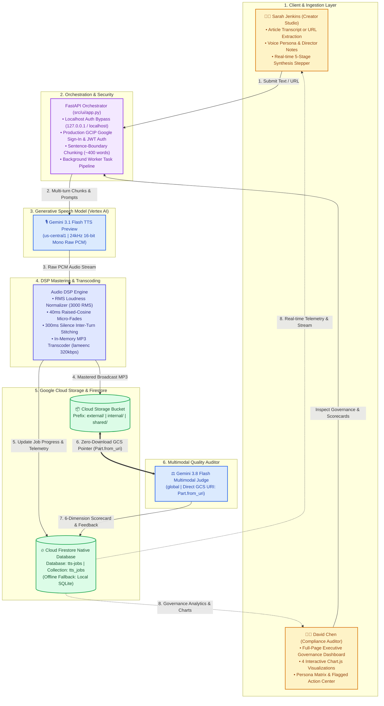

# Apex Bank Knowledge-to-Speech Studio & Multimodal LLM-as-a-Judge Platform

> **Enterprise Financial Services Knowledge-to-Audio Platform with Direct Multimodal Quality Auditing, Full-Page Executive FinOps Governance, and Serverless Cloud Firestore Persistence powered by Google Gemini (Vertex AI), Google Cloud Storage, and Google Cloud Run.**

---

## 1. Executive Summary & Architecture

Knowledge base articles, compliance updates, mortgage advisories, and disclosure bulletins are authored for visual reading on screens. When converted to audio via conventional text-to-speech (TTS) engines, they sound robotic and flat, mispronounce specialized financial acronyms (e.g., *FDIC, APY, APR, KYC, BSA/AML, HELOC*), and lack the natural cadence, pauses, and empathy demanded by banking brand standards.

The **Apex Bank Knowledge-to-Speech Studio** solves these challenges using **Google Gemini Generative Voice (Vertex AI)**:
1. **Direct Generative Speech**: Synthesizes human-like voice directly from prompt directives, eliminating brittle SSML XML tags.
2. **Context-Aware Banking Personas**: 5 pre-configured voices mapped to specific internal employee and external customer audiences.
3. **Acoustic Mastering & Multi-Turn Splicing**: Sentence-boundary chunking, RMS loudness normalization, 40ms raised-cosine micro-fading, and 300ms inter-turn pause stitching.
4. **Google Cloud Storage Audience Prefix Routing**: Automatic partitioning into `external/audio/`, `internal/audio/`, and `shared/audio/` prefixes for IAM CEL Condition access control.
5. **Multimodal LLM-as-a-Judge Quality Audit**: Automated evaluation of the synthesized audio directly from its GCS URI pointer (`types.Part.from_uri()`) against a strict 6-dimension rubric, with zero audio download or streaming into the worker.
6. **Executive FinOps & Compliance Governance**: Full-page interactive **Chart.js** dashboard for compliance auditors featuring Rubric Radars, FinOps spend allocations, persona volume comparisons, and token utilization breakdowns.
7. **Cloud Firestore Serverless Persistence**: Enterprise persistence using **Google Cloud Firestore Native Mode** (`tts-jobs` database), ensuring job history and audit records persist seamlessly across Cloud Run container deployments with automatic SQLite fallback for isolated offline testing.
8. **Dual-Persona Workspace Hub**: Seamless top-navigation switching between **Sarah Jenkins** (Senior Digital Communications Specialist - Content Creator) and **David Chen** (Senior Regulatory Compliance Analyst - Compliance Auditor).
9. **Zero-Config Localhost Auth Bypass**: Automatic loopback detection (`127.0.0.1` / `localhost`) bypassing Google OAuth origin restrictions for instant local developer access while strictly enforcing GCIP JWT cryptographic verification on Google Cloud Run.
10. **Resilient Real-Time Progress UX**: Instant state unshift, self-healing job details fetch, 5-stage live stepper (`CHUNKING` → `SYNTHESIZING` → `STITCHING` → `UPLOADING` → `EVALUATING`), and sample disclosures director tuning.



---

## 2. Getting the Project Going (Makefile Workflow)

The project includes a comprehensive [Makefile](file:///Users/rrangan/Documents/customers/tts-demo/Makefile) powered by [`uv`](https://github.com/astral-sh/uv) to manage the entire lifecycle: environment creation, dependency installation, GCP authentication, cloud bucket provisioning, voice synthesis, web execution, and testing.

To inspect all available targets at any time, run:
```bash
make help
```

---

### 2.1 Prerequisites
- **Python Package Manager**: [`uv`](https://github.com/astral-sh/uv) (handles fast virtualenv creation and package management):
  ```bash
  # macOS / Linux
  curl -LsSf https://astral.sh/uv/install.sh | sh
  ```
- **Zero OS-Level Audio Dependencies**: No `brew install ffmpeg` or `apt-get install -y ffmpeg` is needed! The platform uses [`lameenc`](https://pypi.org/project/lameenc/), an ultra-lightweight (<500KB) pure-Python C-wheel that encodes raw PCM to broadcast 320kbps MP3 in-memory. This design keeps container images minimal and makes the platform 100% portable for **Google Cloud Run** deployment.
- **Google Cloud Access**:
  - A Google Cloud Project with the **Vertex AI API** and **Cloud Storage API** enabled.
  - The Google Cloud CLI (`gcloud`) installed and accessible in your `$PATH`.

---

### 2.2 Environment Setup & Installation

Follow these steps using the `Makefile`:

1. **Clone the Repository**:
   ```bash
   git clone <repository_url>
   cd tts-demo
   ```

2. **Create the Virtual Environment**:
   ```bash
   make venv
   ```
   *Creates an isolated `.venv` using `uv`.*

3. **Install Dependencies & Initialize `.env`**:
   ```bash
   make install
   ```
   *Installs all dependencies in editable mode (`uv pip install -e .`) and automatically copies `.env.example` to `.env` if not already present.*

---

### 2.3 Google Cloud Authentication & Configuration

1. **Configure Your Project Settings in `.env`**:
   Open `.env` and set your GCP Project ID, region, and serverless persistence parameters:
   ```ini
   GCP_PROJECT_ID=your-gcp-project-id
   GOOGLE_CLOUD_PROJECT=your-gcp-project-id
   GOOGLE_CLOUD_LOCATION=us-central1
   GCS_BUCKET_NAME=tts-bank-audio-prod

   # Serverless Cloud Firestore Persistence
   USE_FIRESTORE=true
   FIRESTORE_DATABASE=tts-jobs
   FIRESTORE_COLLECTION=tts_jobs

   # Authentication & Security
   ENABLE_DEMO_AUTH=false
   GOOGLE_CLIENT_ID=your-google-client-id.apps.googleusercontent.com
   GCIP_API_KEY=your-firebase-api-key
   ```

2. **Authenticate with GCP (CLI & Application Default Credentials)**:
   ```bash
   make auth
   ```
   *Smart authentication: automatically checks if `gcloud` CLI and Application Default Credentials (ADC) are already active and skips browser logins if already verified. If credentials or quota projects are missing, it prompts only for the required layer.*

   *Additional authentication controls:*
   - `make auth-force`: Forces a complete interactive browser re-login for both CLI and ADC.
   - `make auth-cli`: Authenticates only the `gcloud` CLI account (with auto-bypass).
   - `make auth-adc`: Authenticates only Application Default Credentials for the Python SDK (with auto-bypass).

3. **Verify and Auto-Align Authentication**:
   ```bash
   make auth-check   # Strictly verifies ADC and project accessibility against .env
   make auth-fix     # Automatically re-aligns gcloud and ADC quota project if mismatched
   ```

4. **Provision Cloud Storage Bucket & Lifecycle Policies**:
   ```bash
   make bucket       # Provisions GCS bucket with random 5-char suffix and lifecycle rules (30-day default vs 0)
   make bucket-info  # Inspects existing bucket configuration, lifecycle rules, and IAM prefix policies
   ```

5. **Migrate Historical Jobs to Cloud Firestore**:
   ```bash
   make migrate-data # Migrates local SQLite jobs (data/tts_jobs.db) into Cloud Firestore Native
   ```

---

### 2.4 Running the Application via Makefile

#### 🚀 Launch the Web Studio (Zero-Config Localhost Auth Bypass)
```bash
# Production mode (FastAPI on http://127.0.0.1:8000):
make ui

# Development mode (with auto-reload enabled):
make ui-dev
```
Open your browser at **`http://127.0.0.1:8000`**. When accessed over local loopback (`127.0.0.1` or `localhost`), the platform automatically activates the **Zero-Config Localhost Auth Bypass**:
- Bypasses Google OAuth origin restrictions without needing Google Cloud Console OAuth redirect configurations.
- Presents the **Workspace Persona Selector Hub** to immediately select either **Sarah Jenkins** (Content Creator) or **David Chen** (Compliance Auditor).
- Displays the `💻 Localhost Dev` badge with instant 1-click workspace switching via the top navigation bar.

#### 🎙️ Voice Synthesis & Quality Judging from CLI
```bash
# Run quickstart end-to-end test on the sample banking article fixture:
make test-core

# Synthesize custom inline text with a selected persona:
make synth TEXT="The Annual Percentage Yield (APY) for our 12-month CD is 4.75% FDIC insured." PERSONA="Retail Banking Guide"

# Synthesize directly from a markdown or text file:
make synth FILE=scripts/samples/sample_article.md PERSONA="Wealth & Market Advisor"
# (or explicitly use make synth-file FILE=scripts/samples/sample_article.md)

# Synthesize audio only (skipping the Multimodal LLM Judge):
make synth-only FILE=scripts/samples/sample_article.md
```

#### 🧪 Testing, Quality & Maintenance
```bash
# Run 75 unit and integration tests with pytest via uv (executes in ~3s):
make test

# Launch the interactive step-by-step terminal test menu:
make test-menu

# Clean temporary caches and build artifacts (preserves .venv):
make clean

# Deep clean: remove caches AND the virtual environment (.venv):
make clean-all
```

#### ☁️ Google Cloud Run Deployment (Python 3.13)
The platform is fully containerized with Python 3.13 and ready for 1-command deployment to Google Cloud Run via Google Cloud Build (no local Docker daemon required):

```bash
# Deploy directly to Google Cloud Run (automatically injects .env and Firestore settings):
make deploy

# Retrieve the live HTTPS public URL:
make cloud-run-url

# Stream live container logs:
make cloud-run-logs

# Start an authenticated local proxy tunnel to Cloud Run:
make cloud-run-proxy

# Optional: Build and test the container locally on http://localhost:8080:
make docker-build
make docker-run
```

---

## 3. Step-by-Step Technical Deep Dive with Code Snippets

Here is the exact technical execution path executed when a user submits an article:

```
[1. URL Extractor] ──> [2. Persona & Directives] ──> [3. Sentence Chunking]
                                                              │
[6. GCS Audience Upload] <── [5. DSP Mastering] <── [4. Gemini TTS Multi-Turn]
         │
[7. Multimodal Judge] ──> [8. FinOps Cost Accounting] ──> [9. Web Player & Scorecard]
```

---

### Step 1: Article Ingestion & Content Extraction
**File**: [`src/utils/extractor.py`](file:///Users/rrangan/Documents/customers/tts-demo/src/utils/extractor.py)

When a web URL is supplied, [`extract_article_from_url()`](file:///Users/rrangan/Documents/customers/tts-demo/src/utils/extractor.py#L227-L269) fetches the page with anti-scraping headers and uses [`MainContentHTMLParser`](file:///Users/rrangan/Documents/customers/tts-demo/src/utils/extractor.py#L22-L187) to eliminate navigation menus, cookie notices, marketing sidebars, and script tags:

```python
# From src/utils/extractor.py
class MainContentHTMLParser(HTMLParser):
    IGNORE_TAGS = {
        "script", "style", "noscript", "header", "footer", "nav",
        "aside", "form", "svg", "button", "select", "option", "dialog"
    }
    BLOCK_TAGS = {"p", "h1", "h2", "h3", "h4", "h5", "h6", "li", "blockquote"}

    def handle_starttag(self, tag: str, attrs: List[Tuple[str, Optional[str]]]):
        if tag.lower() in self.IGNORE_TAGS:
            self.ignore_depth += 1
            return
        # Identifies semantic article / main containers
        if tag.lower() in {"article", "main"} or any("article" in v for k, v in attrs):
            self.article_depth += 1
```

---

### Step 2: Persona Resolution & Financial Acronym Guidelines
**File**: [`src/ai/personas.py`](file:///Users/rrangan/Documents/customers/tts-demo/src/ai/personas.py)

Each persona binds an audience, a Google Gen AI prebuilt voice, and standardized pronunciation directives:

```python
# From src/ai/personas.py
COMMON_FINANCIAL_PRONUNCIATION_DIRECTIVES = """
FINANCIAL PRONUNCIATION & TERMINOLOGY GUIDELINES:
- Acronyms: "KYC" -> "K-Y-C", "AML" -> "A-M-L", "FDIC" -> "F-D-I-C", "FINRA" -> "fin-rah"
- Lending: "APR" -> "A-P-R", "APY" -> "A-P-Y", "HELOC" -> "hee-lock"
- Currency: Read "$1.5M" as "one point five million dollars", "4.75%" as "four point seven five percent"
- Recording: Deliver narration in an acoustically dry booth with zero room reverberation.
"""

PERSONAS = {
    "Retail Banking Guide": VoicePersona(
        name="Retail Banking Guide",
        audience="External Customers",
        voice_name="Sulafat",  # Warm, reassuring
        system_instruction=...
    ),
    "Wealth & Market Advisor": VoicePersona(
        name="Wealth & Market Advisor",
        audience="External Customers",
        voice_name="Charon",   # Sophisticated, consultative
        system_instruction=...
    ),
    "Regulatory & Policy Officer": VoicePersona(
        name="Regulatory & Policy Officer",
        audience="Internal Employees",
        voice_name="Kore",     # Authoritative, firm
        system_instruction=...
    )
}
```

---

### Step 3: Sentence-Bound Text Chunking
**File**: [`src/ai/generator.py`](file:///Users/rrangan/Documents/customers/tts-demo/src/ai/generator.py)

To prevent HTTP streaming timeouts and maintain natural sentence rhythm on long-form articles, [`split_text_into_chunks()`](file:///Users/rrangan/Documents/customers/tts-demo/src/ai/generator.py#L46-L90) partitions text targeting ~400 words without cutting sentences or bullet points:

```python
# From src/ai/generator.py
def split_text_into_chunks(text: str, target_words: Optional[int] = None) -> List[str]:
    limit = target_words or settings.tts_chunk_word_limit
    if len(text.split()) <= limit:
        return [text]

    # Split into paragraphs, then split on terminal punctuation (.?!) followed by capital letters
    paragraphs = text.split("\n\n")
    units = []
    for p in paragraphs:
        sentences = re.split(r'(?<=[.?!])\s+(?=[A-Z0-9\"\'\‘\“])', p.strip())
        for idx, s in enumerate(sentences):
            if s.strip():
                units.append((s.strip(), idx == 0))
    ...
```

---

### Step 4: Multi-Turn Continuity Directives & Gemini Speech Generation
**File**: [`src/ai/generator.py`](file:///Users/rrangan/Documents/customers/tts-demo/src/ai/generator.py)

For multi-chunk articles, [`_generate_single_chunk()`](file:///Users/rrangan/Documents/customers/tts-demo/src/ai/generator.py#L194-L270) injects **Audio Continuity Directives** on turns $2 \dots N$, instructing the model to match the exact pitch floor, speaking cadence, and acoustic energy of the previous segment:

```python
# From src/ai/generator.py
if total_chunks > 1:
    if chunk_index == 1:
        turn_context = "AUDIO CONTINUITY DIRECTIVE (PART 1): Deliver speech with a clean studio baseline.\n\n"
    else:
        turn_context = (
            f"AUDIO CONTINUITY DIRECTIVE (PART {chunk_index} OF {total_chunks}):\n"
            "This is a direct, seamless continuation of the previous section. You MUST maintain the exact same "
            "pitch baseline, vocal energy, speaking cadence, and microphone distance so this segment splices seamlessly.\n\n"
        )

speech_config = types.SpeechConfig(
    voice_config=types.VoiceConfig(
        prebuilt_voice_config=types.PrebuiltVoiceConfig(voice_name=persona.voice_name)
    )
)
config = types.GenerateContentConfig(
    response_modalities=["AUDIO"],
    speech_config=speech_config,
    automatic_function_calling=types.AutomaticFunctionCallingConfig(disable=True)
)
response = self.client.models.generate_content(
    model=self.model, contents=full_prompt, config=config
)
```

---

### Step 5: DSP Audio Mastering & MP3 Transcoding
**File**: [`src/ai/generator.py`](file:///Users/rrangan/Documents/customers/tts-demo/src/ai/generator.py)

Each turn's raw PCM audio undergoes digital signal processing before concatenation:
1. **RMS Loudness Normalization**: [`normalize_chunk_rms()`](file:///Users/rrangan/Documents/customers/tts-demo/src/ai/generator.py#L105-L137) calculates Root Mean Square loudness and applies bounded gain scaling to eliminate volume jumps.
2. **Micro-Fading**: [`apply_micro_fades()`](file:///Users/rrangan/Documents/customers/tts-demo/src/ai/generator.py#L139-L165) applies a 40ms raised-cosine fade-in/out to prevent boundary DC-offset clicks.
3. **Turn Stitching**: Concatenates chunks with a **300ms natural silence pause** (`b"\x00"`).
4. **In-Memory MP3 Transcoding**: Encoded via [`lameenc`](https://pypi.org/project/lameenc/) at 24kHz mono @ 320kbps directly in C memory (with graceful fallback to `ffmpeg` or `wave` container):

```python
# From src/ai/generator.py
encoder = lameenc.Encoder()
encoder.set_channels(1)
encoder.set_in_sample_rate(24000)
encoder.set_bit_rate(320)
encoder.set_quality(2)  # High-quality LAME psychoacoustic profile
mp3_bytes = bytes(encoder.encode(raw_pcm_bytes) + encoder.flush())
```

---

### Step 6: Audience Prefix Routing & GCS Storage
**File**: [`src/storage/gcs_client.py`](file:///Users/rrangan/Documents/customers/tts-demo/src/storage/gcs_client.py)

Audio assets are routed to GCS prefix directories matching their audience, enabling fine-grained IAM CEL condition access control:

```python
# From src/storage/gcs_client.py
def get_prefix_for_persona(persona_name: Optional[str] = None, audience: Optional[str] = None) -> str:
    if audience == "Internal Employees":
        return "internal/audio"
    elif audience == "Both":
        return "shared/audio"
    else:
        return "external/audio"

# Upload and generate 60-minute time-limited signed URL
gcs_uri, signed_url = gcs_client.upload_audio_bytes(
    audio_bytes=gen_result.audio_bytes,
    job_id=job_id,
    persona_name=persona_name,
    content_type="audio/mpeg"
)
```

---

### Step 7: Multimodal LLM-as-a-Judge Quality Evaluation
**File**: [`src/ai/judge.py`](file:///Users/rrangan/Documents/customers/tts-demo/src/ai/judge.py)

The judge model evaluates the synthesized audio by passing the GCS URI directly (`types.Part.from_uri()`). **The worker never downloads or buffers the audio bytes**:

```python
# From src/ai/judge.py
audio_part = types.Part.from_uri(
    file_uri=gcs_audio_uri,
    mime_type="audio/mpeg"
)

gen_config = types.GenerateContentConfig(
    system_instruction=RUBRIC_SYSTEM_INSTRUCTION,
    response_mime_type="application/json",
    response_schema=QualityEvaluationResponse,
    automatic_function_calling=types.AutomaticFunctionCallingConfig(disable=True)
)

response = self.client.models.generate_content(
    model=self.model,
    contents=[prompt, audio_part],
    config=gen_config
)
```

#### The 6 Grading Rubric Dimensions:
1. **Script Adherence & Accuracy (25%)**: Verifies verbatim accuracy; penalizes skipped parentheticals, word omissions, or repeated sentences.
2. **Naturalness & Inflection (20%)**: Assesses conversational transitions and human pitch dynamic range versus robotic monotone.
3. **Pacing & Breathing (15%)**: Evaluates rhetorical pauses between headings, steps, and key financial figures.
4. **Tone Congruence (15%)**: Measures adherence to the assigned persona's emotional tone.
5. **Pronunciation & Jargon (15%)**: Confirms 100% accurate pronunciation of banking acronyms (*FDIC, APY, ACH, KYC*).
6. **Acoustic Quality (10%)**: Checks for zero robotic clipping, buzzing, or abrupt volume shifts.

---

### Step 8: Token Usage Telemetry & FinOps Cost Calculation
**File**: [`src/ai/cost_calculator.py`](file:///Users/rrangan/Documents/customers/tts-demo/src/ai/cost_calculator.py)

Token usage is tracked across both models and both directions (Input and Output):

$$\text{Total Cost} = \left(\frac{\text{TTS In}}{10^6} \times \$0.10\right) + \left(\frac{\text{TTS Out}}{10^6} \times \$2.00\right) + \left(\frac{\text{Judge In}}{10^6} \times \$0.15\right) + \left(\frac{\text{Judge Out}}{10^6} \times \$0.60\right)$$

```python
# From src/ai/cost_calculator.py
tts_cost = (
    (input_text_tokens / 1_000_000.0) * tts_pricing["text_input_per_1m"] +
    (audio_output_tokens / 1_000_000.0) * tts_pricing["audio_output_per_1m"]
)
judge_cost = (
    (judge_input_tokens / 1_000_000.0) * judge_pricing["input_per_1m"] +
    (judge_output_tokens / 1_000_000.0) * judge_pricing["output_per_1m"]
)
```

---

### Step 9: Serverless Cloud Firestore Persistence & Offline SQLite Fallback
**File**: [`src/db/repository.py`](file:///Users/rrangan/Documents/customers/tts-demo/src/db/repository.py)

In containerized serverless deployments like Google Cloud Run, local container disk storage is ephemeral and is discarded on every revision deployment or scaling event. To guarantee total persistence for historical audio records, telemetry, and multimodal evaluations, the platform uses **Google Cloud Firestore Native Mode**:

- **Database**: `tts-jobs` (or configured via `FIRESTORE_DATABASE`).
- **Collection**: `tts_jobs` (or configured via `FIRESTORE_COLLECTION`).
- **Atomic Progress Updates**: Real-time progress updates (`CHUNKING` $\to$ `SYNTHESIZING` $\to$ `STITCHING` $\to$ `UPLOADING` $\to$ `EVALUATING`) update the document directly without re-writing full payloads.
- **Index Optimization & Fallback**: Standard descending query by `created_at` with composite persona filtering, falling back gracefully to in-memory filtering if cloud index creation is pending.
- **Offline SQLite Resiliency**: When `USE_FIRESTORE=false` (e.g., during offline pytest execution or airgapped testing), the factory seamlessly instantiates `SQLiteJobRepository` at `data/tts_jobs.db`, ensuring 100% test isolation and zero network dependencies.
- **Automated Data Migration**: `sync_sqlite_to_firestore_if_empty()` automatically checks Firestore upon startup; if empty, it migrates historical records from SQLite into Firestore Native. Standalone migrations can also be triggered at any time via `make migrate-data`.

```python
# From src/db/repository.py
class FirestoreJobRepository(BaseJobRepository):
    def __init__(self, project_id: str, collection_name: str = "tts_jobs", database_name: str = "tts-jobs"):
        from google.cloud import firestore
        self.client = firestore.Client(project=project_id, database=database_name)
        self.collection = self.client.collection(collection_name)

    def save_job(self, job: JobRecord) -> None:
        doc_data = job.model_dump()
        self.collection.document(job.job_id).set(doc_data)

    def update_job_progress(self, job_id: str, progress_stage: str, progress_message: str,
                            current_turn: Optional[int] = None, total_turns: Optional[int] = None) -> None:
        self.collection.document(job_id).update({
            "progress_stage": progress_stage,
            "progress_message": progress_message,
            "current_turn": current_turn,
            "total_turns": total_turns,
        })
```

---

### Step 10: Executive Auditor Dashboard & Interactive Chart.js Telemetry
**File**: [`src/ui/templates/index.html`](file:///Users/rrangan/Documents/customers/tts-demo/src/ui/templates/index.html)

For compliance officers and Senior Regulatory Compliance Analyst (**David Chen**), the platform provides a dedicated full-page **Executive Governance Dashboard** powered by Chart.js:

1. **Top-Line KPI Metric Cards**:
   - Total FinOps Spend (USD split between Speech Generation and Multimodal Auditing).
   - Cumulative Token Volume across text, audio streams, and multimodal evaluation.
   - Compliance Quality Gate pass rate ($\ge 4.0 / 5.0$).
   - Total Audited Audio Runtime in minutes.
2. **Interactive Chart.js Visualizations**:
   - **Multimodal Rubric Radar (`chartRubricRadar`)**: Displays the 6-dimension quality polygon against the 4.0 benchmark threshold line.
   - **FinOps Pipeline Cost Allocation Donut (`chartFinopsSplit`)**: Compares Speech Generation expenditure to Quality Auditing overhead.
   - **Persona Quality Benchmarks Bar Chart (`chartPersonaBars`)**: Benchmarks average scores across all 5 personas against the 4.0 regulatory compliance line.
   - **Token Volume Modality Stack (`chartTokenStack`)**: Visualizes token consumption by modality (Input Text, Audio Stream, and Evaluation).
3. **Persona Governance Matrix**: Aggregated table providing total volume, pass rate percentage, average score, cumulative spend, token counts, and regulatory status badges per persona.
4. **Unit Economics & Cloud Governance Specs**:
   - Cost per Audio Minute: **\$0.0034 / min**.
   - Cost per Audited Disclosure: **\$0.0182 / disclosure**.
   - Auditor Overhead Ratio: typically **~10% to 15%** of total pipeline cost.
5. **Flagged Disclosures Action Center**: Live filtered list of items scoring below 4.0 with direct 1-click access to full audio playback and audit critique.

---

### Step 11: Zero-Config Localhost Auth Bypass & Production GCIP Verification
**File**: [`src/ui/app.py`](file:///Users/rrangan/Documents/customers/tts-demo/src/ui/app.py)

Enterprise cloud applications deployed to Google Cloud Run typically authenticate users with **Google Cloud Identity Platform (GCIP)** and Google Sign-In with OAuth 2.0. However, local developer loopback addresses (`127.0.0.1` and `localhost`) often conflict with strict Google OAuth authorized redirect URI policies.

The platform implements an intelligent dual-mode authentication engine:
- **Localhost Loopback Detection (`is_localhost_request`)**:
  Inspects `request.client.host`, `request.headers.get("host")`, and `request.url.hostname`. If the request originates from local development (`127.0.0.1`, `localhost`, or `::1`), it automatically issues a verified developer session with the `is_localhost: True` attribute.
- **Top-Navigation Persona Hub**:
  Allows the user to seamlessly toggle the active persona between **Sarah Jenkins** (`creator`) and **David Chen** (`auditor`) directly from the header without logging out.
- **Strict Production GCIP Protection on Cloud Run**:
  When deployed to Google Cloud Run, non-loopback requests strictly enforce Google ID Token cryptographic validation via Google's public RS256 JWKS keys (`verify_gcip_token`), checking signature integrity, expiration timestamps, and authorized enterprise domain restrictions (`ALLOWED_DOMAINS`).

```python
# From src/ui/app.py
def is_localhost_request(request: Request = None) -> bool:
    if not request:
        return False
    host = (request.headers.get("host") or "").split(":")[0].lower()
    client_host = (request.client.host if request.client else "").lower()
    server_host = (request.url.hostname or "").lower()
    return (
        host in ("localhost", "127.0.0.1", "0.0.0.0")
        or client_host in ("127.0.0.1", "::1", "localhost")
        or server_host in ("localhost", "127.0.0.1", "0.0.0.0")
    )
```

---

## 4. Repository Layout

```
tts-demo/
├── .env.example                  # Environment configuration template
├── PRD.md                        # Product Requirements Document
├── README.md                     # Technical architecture and setup guide (this file)
├── USER_GUIDE.md                 # End-user visual walkthrough with screenshots
├── Makefile                      # Unified automation workflow (setup, auth, run, test, deploy)
├── pyproject.toml                # Project metadata & build configuration
├── requirements.txt              # Production Python dependencies
├── docs/
│   └── images/                   # Visual screenshots embedded in USER_GUIDE.md
├── scripts/
│   ├── run_quickstart.py         # Rich CLI runner for quickstart synthesis
│   ├── setup_bucket.py           # GCS bucket provisioning & lifecycle configuration
│   ├── verify_gcp_auth.py        # GCP authentication & ADC inspection tool
│   ├── migrate_sqlite_to_firestore.py # SQLite to Cloud Firestore Native batch migration
│   └── samples/                  # Sample markdown articles & cached MP3 output
├── src/
│   ├── config.py                 # Pydantic Settings & environment loader
│   ├── ai/
│   │   ├── generator.py          # Gemini Generative Speech generation & DSP mastering
│   │   ├── judge.py              # Multimodal LLM-as-a-Judge 6-dimension evaluation
│   │   ├── personas.py           # Voice personas & financial pronunciation rules
│   │   └── cost_calculator.py    # Token usage & FinOps billing engine
│   ├── db/
│   │   ├── models.py             # Pydantic models (JobRecord, Scorecards, CostBreakdown)
│   │   └── repository.py         # Hybrid persistence: Cloud Firestore Native + SQLite fallback
│   ├── storage/
│   │   └── gcs_client.py         # GCS Client with audience prefix routing & signed URLs
│   ├── ui/
│   │   ├── app.py                # FastAPI REST API, auth engine, & background task runner
│   │   ├── static/               # Static web assets
│   │   └── templates/            # Modular Jinja2 SPA templates & JavaScript modules
│   │       ├── index.html        # Root application layout shell
│   │       └── partials/         # Auth, views, drawers, modals, and JS modules
│   └── utils/
│       ├── extractor.py          # Main article content extractor & HTML parser
│       └── logger.py             # Cloud Logging & local rotating file handler
└── tests/                        # 90 comprehensive automated unit and integration tests
```

---

## 5. Security, Compliance & Data Governance

1. **Zero Data Retention for Training**: Text transcripts and synthesized audio processed via Vertex AI are **never used to train foundation models**.
2. **Encryption Standards**: Audio files stored in Google Cloud Storage are encrypted using **AES-256 at-rest** and **TLS 1.3 in-transit**.
3. **Time-Limited Signed URLs**: Audio is streamed via secure 60-minute V4 Signed URLs, preventing public exposure of confidential internal banking bulletins.
4. **IAM Condition Prefix Isolation**: GCS bucket permissions enforce strict audience separation:
   - External customers cannot access `internal/audio/*` objects.
   - Internal staff access is governed by employee SSO roles.
5. **Serverless Cloud Firestore Security**: Job history and audit telemetry are governed by Google Cloud IAM and Firestore Security Rules, ensuring audit records remain immutable.
6. **Localhost Isolation**: The Localhost Auth Bypass is strictly isolated to loopback network interfaces and is disabled when running on public IP or Cloud Run hostnames.

---

## 6. Comprehensive Automated Verification & Test Suite

The platform includes a robust automated test suite comprising **75 pytest tests** that execute in ~3 seconds. The test suite guarantees end-to-end reliability across all audio, AI, persistence, and security layers:

```bash
# Execute the full automated test suite (with offline SQLite isolation)
make test
# Or directly via uv:
USE_FIRESTORE=false uv run pytest tests/ -v
```

### Test Coverage Highlights:
- **Authentication & Security (`tests/test_auth.py` — 20 tests)**:
  Verifies localhost loopback detection, mock developer tokens, GCIP ID token verification, domain restrictions, and persona context injection.
- **Web UI & API Endpoints (`tests/test_ui.py` — 21 tests)**:
  Tests single job synthesis, bulk URL queuing, live 5-stage progress reporting (`CHUNKING` $\to$ `EVALUATING`), modal fallback resilience, and job deletion.
- **Audio DSP & Synthesis Pipeline (`tests/test_generator.py` — 8 tests)**:
  Validates sentence-boundary chunking, RMS loudness normalization, micro-fades, silence stitching, and MP3 encoding.
- **Multimodal LLM-as-a-Judge (`tests/test_judge.py` — 5 tests)**:
  Verifies zero-download GCS URI evaluation (`types.Part.from_uri()`), JSON schema parsing, and rubric dimension weighting.
- **Job Repository & Persistence (`tests/test_repository.py` — 7 tests)**:
  Verifies SQLite operations, Firestore repository models, progress updates, seeding, and auto-migration logic.
- **Cloud Storage Client (`tests/test_gcs.py` — 4 tests)**:
  Tests audience prefix key generation (`external/`, `internal/`, `shared/`) and signed URL generation.
- **FinOps Cost Accounting & Article Extractor (`tests/test_cost.py`, `tests/test_extractor.py`, `tests/test_personas.py` — 10 tests)**:
  Ensures precision in token math, pricing formulas, HTML cleaning, and pronunciation directives.

