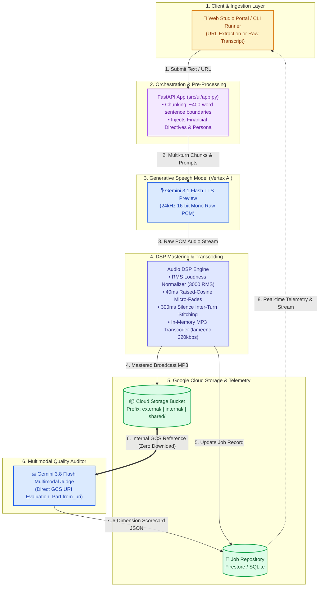

# Apex Bank Knowledge-to-Speech Studio & Multimodal LLM-as-a-Judge Platform

> **Enterprise Financial Services Knowledge-to-Audio Platform with Direct Multimodal Quality Auditing and FinOps Telemetry powered by Google Gemini (Vertex AI) and Google Cloud Storage.**

---

## 1. Executive Summary & Architecture

Knowledge base articles, compliance updates, mortgage advisories, and disclosure bulletins are authored for visual reading on screens. When converted to audio via conventional text-to-speech (TTS) engines, they sound robotic and flat, mispronounce specialized financial acronyms (e.g., *FDIC, APY, APR, KYC, BSA/AML, HELOC*), and lack the natural cadence, pauses, and empathy demanded by banking brand standards.

The **Apex Bank Knowledge-to-Speech Studio** solves these challenges using **Google Gemini Generative Voice (Vertex AI)**:
1. **Direct Generative Speech**: Synthesizes human-like voice directly from prompt directives, eliminating brittle SSML XML tags.
2. **Context-Aware Banking Personas**: 5 pre-configured voices mapped to specific internal employee and external customer audiences.
3. **Acoustic Mastering & Multi-Turn Splicing**: Sentence-boundary chunking, RMS loudness normalization, 40ms raised-cosine micro-fading, and 300ms inter-turn pause stitching.
4. **Google Cloud Storage Audience Prefix Routing**: Automatic partitioning into `external/audio/`, `internal/audio/`, and `shared/audio/` prefixes for IAM CEL Condition access control.
5. **Multimodal LLM-as-a-Judge Quality Audit**: Automated evaluation of the synthesized audio directly from its GCS URI pointer (`types.Part.from_uri()`) against a strict 6-dimension rubric, with zero audio download or streaming into the worker.
6. **FinOps Telemetry**: Granular per-article token accounting (TTS input/output, Judge input/output) and real-time USD billing calculations.



---

## 2. Getting the Project Going (Makefile Workflow)

The project includes a comprehensive [Makefile](file:///Users/rrangan/Documents/customers/tts-demo/Makefile) powered by [`uv`](https://github.com/astral-sh/uv) to manage the entire lifecycle: environment creation, dependency installation, GCP authentication, cloud bucket provisioning, voice synthesis, web execution, and testing.

To inspect all available targets at any time, run:
```bash
make help
```

---

### 2.1 Prerequisites
- **Python Package Manager**: [`uv`](https://github.com/astral-sh/uv) (handles fast virtualenv creation and package management):
  ```bash
  # macOS / Linux
  curl -LsSf https://astral.sh/uv/install.sh | sh
  ```
- **Zero OS-Level Audio Dependencies**: No `brew install ffmpeg` or `apt-get install -y ffmpeg` is needed! The platform uses [`lameenc`](https://pypi.org/project/lameenc/), an ultra-lightweight (<500KB) pure-Python C-wheel that encodes raw PCM to broadcast 320kbps MP3 in-memory. This design keeps container images minimal and makes the platform 100% portable for **Google Cloud Run** deployment.
- **Google Cloud Access**:
  - A Google Cloud Project with the **Vertex AI API** and **Cloud Storage API** enabled.
  - The Google Cloud CLI (`gcloud`) installed and accessible in your `$PATH`.

---

### 2.2 Environment Setup & Installation

Follow these steps using the `Makefile`:

1. **Clone the Repository**:
   ```bash
   git clone <repository_url>
   cd tts-demo
   ```

2. **Create the Virtual Environment**:
   ```bash
   make venv
   ```
   *Creates an isolated `.venv` using `uv`.*

3. **Install Dependencies & Initialize `.env`**:
   ```bash
   make install
   ```
   *Installs all dependencies in editable mode (`uv pip install -e .`) and automatically copies `.env.example` to `.env` if not already present.*

---

### 2.3 Google Cloud Authentication & Configuration

1. **Configure Your Project Settings in `.env`**:
   Open `.env` and set your GCP Project ID and region:
   ```ini
   GCP_PROJECT_ID=your-gcp-project-id
   GOOGLE_CLOUD_PROJECT=your-gcp-project-id
   GOOGLE_CLOUD_LOCATION=us-central1
   GCS_BUCKET_NAME=tts-bank-audio-prod
   ```

2. **Authenticate with GCP (CLI & Application Default Credentials)**:
   ```bash
   make auth
   ```
   *Smart authentication: automatically checks if `gcloud` CLI and Application Default Credentials (ADC) are already active and skips browser logins if already verified. If credentials or quota projects are missing, it prompts only for the required layer.*

   *Additional authentication controls:*
   - `make auth-force`: Forces a complete interactive browser re-login for both CLI and ADC.
   - `make auth-cli`: Authenticates only the `gcloud` CLI account (with auto-bypass).
   - `make auth-adc`: Authenticates only Application Default Credentials for the Python SDK (with auto-bypass).

3. **Verify and Auto-Align Authentication**:
   ```bash
   make auth-check   # Strictly verifies ADC and project accessibility against .env
   make auth-fix     # Automatically re-aligns gcloud and ADC quota project if mismatched
   ```

4. **Provision Cloud Storage Bucket & Lifecycle Policies**:
   ```bash
   make bucket       # Provisions GCS bucket with random 5-char suffix and lifecycle rules (30-day default vs 0)
   make bucket-info  # Inspects existing bucket configuration, lifecycle rules, and IAM prefix policies
   ```

---

### 2.4 Running the Application via Makefile

#### 🚀 Launch the Web Studio
```bash
# Production mode (FastAPI on http://127.0.0.1:8000):
make ui

# Development mode (with auto-reload enabled):
make ui-dev
```
Open your browser at **`http://127.0.0.1:8000`**.

**Pre-configured Banking Credentials**:
- **Sarah Jenkins** (Chief Communications Officer): `admin@apexbank.com` / `demo1234`
- **David Chen** (VP Regulatory Compliance): `auditor@apexbank.com` / `demo1234`

#### 🎙️ Voice Synthesis & Quality Judging from CLI
```bash
# Run quickstart end-to-end test on the sample banking article fixture:
make test-core

# Synthesize custom inline text with a selected persona:
make synth TEXT="The Annual Percentage Yield (APY) for our 12-month CD is 4.75% FDIC insured." PERSONA="Retail Banking Guide"

# Synthesize directly from a markdown or text file:
make synth-file FILE=scripts/samples/sample_article.md PERSONA="Wealth & Market Advisor"

# Synthesize audio only (skipping the Multimodal LLM Judge):
make synth-only FILE=scripts/samples/sample_article.md
```

#### 🧪 Testing, Quality & Maintenance
```bash
# Run unit and integration tests with pytest via uv:
make test

# Launch the interactive step-by-step terminal test menu:
make test-menu

# Clean temporary caches, pytest artifacts, and the virtual environment:
make clean
```

#### ☁️ Google Cloud Run Deployment & Access (Python 3.13)
The platform is fully containerized with Python 3.13 and ready for 1-command deployment to Google Cloud Run via Google Cloud Build (no local Docker daemon required):

```bash
# 1. Deploy directly to Google Cloud Run (automatically injects .env settings):
make deploy

# 2. Retrieve the deployed HTTPS URL:
make cloud-run-url

# 3. Stream live container logs:
make cloud-run-logs

# 4. Open the live Cloud Run app in your browser via authenticated GCP proxy:
# (Avoids 403 Forbidden under Domain Restricted Sharing / corporate org policies)
make cloud-run-browse
# or keep the local tunnel open manually on http://localhost:8080:
make cloud-run-proxy

# 5. Share a live demo publicly with external stakeholders/clients (no GCP login needed):
make share             # Shares local UI on port 8000
make share-cloud-run   # Shares Cloud Run proxy on port 8080

# Optional: Build and test the container locally on http://localhost:8080:
make docker-build
make docker-run
```


---

## 3. Step-by-Step Technical Deep Dive with Code Snippets

Here is the exact technical execution path executed when a user submits an article:

```
[1. URL Extractor] ──> [2. Persona & Directives] ──> [3. Sentence Chunking]
                                                              │
[6. GCS Audience Upload] <── [5. DSP Mastering] <── [4. Gemini TTS Multi-Turn]
         │
[7. Multimodal Judge] ──> [8. FinOps Cost Accounting] ──> [9. Web Player & Scorecard]
```

---

### Step 1: Article Ingestion & Content Extraction
**File**: [`src/utils/extractor.py`](file:///Users/rrangan/Documents/customers/tts-demo/src/utils/extractor.py)

When a web URL is supplied, [`extract_article_from_url()`](file:///Users/rrangan/Documents/customers/tts-demo/src/utils/extractor.py#L227-L269) fetches the page with anti-scraping headers and uses [`MainContentHTMLParser`](file:///Users/rrangan/Documents/customers/tts-demo/src/utils/extractor.py#L22-L187) to eliminate navigation menus, cookie notices, marketing sidebars, and script tags:

```python
# From src/utils/extractor.py
class MainContentHTMLParser(HTMLParser):
    IGNORE_TAGS = {
        "script", "style", "noscript", "header", "footer", "nav",
        "aside", "form", "svg", "button", "select", "option", "dialog"
    }
    BLOCK_TAGS = {"p", "h1", "h2", "h3", "h4", "h5", "h6", "li", "blockquote"}

    def handle_starttag(self, tag: str, attrs: List[Tuple[str, Optional[str]]]):
        if tag.lower() in self.IGNORE_TAGS:
            self.ignore_depth += 1
            return
        # Identifies semantic article / main containers
        if tag.lower() in {"article", "main"} or any("article" in v for k, v in attrs):
            self.article_depth += 1
```

---

### Step 2: Persona Resolution & Financial Acronym Guidelines
**File**: [`src/ai/personas.py`](file:///Users/rrangan/Documents/customers/tts-demo/src/ai/personas.py)

Each persona binds an audience, a Google Gen AI prebuilt voice, and standardized pronunciation directives:

```python
# From src/ai/personas.py
COMMON_FINANCIAL_PRONUNCIATION_DIRECTIVES = """
FINANCIAL PRONUNCIATION & TERMINOLOGY GUIDELINES:
- Acronyms: "KYC" -> "K-Y-C", "AML" -> "A-M-L", "FDIC" -> "F-D-I-C", "FINRA" -> "fin-rah"
- Lending: "APR" -> "A-P-R", "APY" -> "A-P-Y", "HELOC" -> "hee-lock"
- Currency: Read "$1.5M" as "one point five million dollars", "4.75%" as "four point seven five percent"
- Recording: Deliver narration in an acoustically dry booth with zero room reverberation.
"""

PERSONAS = {
    "Retail Banking Guide": VoicePersona(
        name="Retail Banking Guide",
        audience="External Customers",
        voice_name="Sulafat",  # Warm, reassuring
        system_instruction=...
    ),
    "Wealth & Market Advisor": VoicePersona(
        name="Wealth & Market Advisor",
        audience="External Customers",
        voice_name="Charon",   # Sophisticated, consultative
        system_instruction=...
    ),
    "Regulatory & Policy Officer": VoicePersona(
        name="Regulatory & Policy Officer",
        audience="Internal Employees",
        voice_name="Kore",     # Authoritative, firm
        system_instruction=...
    )
}
```

---

### Step 3: Sentence-Bound Text Chunking
**File**: [`src/ai/generator.py`](file:///Users/rrangan/Documents/customers/tts-demo/src/ai/generator.py)

To prevent HTTP streaming timeouts and maintain natural sentence rhythm on long-form articles, [`split_text_into_chunks()`](file:///Users/rrangan/Documents/customers/tts-demo/src/ai/generator.py#L46-L90) partitions text targeting ~400 words without cutting sentences or bullet points:

```python
# From src/ai/generator.py
def split_text_into_chunks(text: str, target_words: Optional[int] = None) -> List[str]:
    limit = target_words or settings.tts_chunk_word_limit
    if len(text.split()) <= limit:
        return [text]

    # Split into paragraphs, then split on terminal punctuation (.?!) followed by capital letters
    paragraphs = text.split("\n\n")
    units = []
    for p in paragraphs:
        sentences = re.split(r'(?<=[.?!])\s+(?=[A-Z0-9\"\'\‘\“])', p.strip())
        for idx, s in enumerate(sentences):
            if s.strip():
                units.append((s.strip(), idx == 0))
    ...
```

---

### Step 4: Multi-Turn Continuity Directives & Gemini Speech Generation
**File**: [`src/ai/generator.py`](file:///Users/rrangan/Documents/customers/tts-demo/src/ai/generator.py)

For multi-chunk articles, [`_generate_single_chunk()`](file:///Users/rrangan/Documents/customers/tts-demo/src/ai/generator.py#L194-L270) injects **Audio Continuity Directives** on turns $2 \dots N$, instructing the model to match the exact pitch floor, speaking cadence, and acoustic energy of the previous segment:

```python
# From src/ai/generator.py
if total_chunks > 1:
    if chunk_index == 1:
        turn_context = "AUDIO CONTINUITY DIRECTIVE (PART 1): Deliver speech with a clean studio baseline.\n\n"
    else:
        turn_context = (
            f"AUDIO CONTINUITY DIRECTIVE (PART {chunk_index} OF {total_chunks}):\n"
            "This is a direct, seamless continuation of the previous section. You MUST maintain the exact same "
            "pitch baseline, vocal energy, speaking cadence, and microphone distance so this segment splices seamlessly.\n\n"
        )

speech_config = types.SpeechConfig(
    voice_config=types.VoiceConfig(
        prebuilt_voice_config=types.PrebuiltVoiceConfig(voice_name=persona.voice_name)
    )
)
config = types.GenerateContentConfig(
    response_modalities=["AUDIO"],
    speech_config=speech_config,
    automatic_function_calling=types.AutomaticFunctionCallingConfig(disable=True)
)
response = self.client.models.generate_content(
    model=self.model, contents=full_prompt, config=config
)
```

---

### Step 5: DSP Audio Mastering & MP3 Transcoding
**File**: [`src/ai/generator.py`](file:///Users/rrangan/Documents/customers/tts-demo/src/ai/generator.py)

Each turn's raw PCM audio undergoes digital signal processing before concatenation:
1. **RMS Loudness Normalization**: [`normalize_chunk_rms()`](file:///Users/rrangan/Documents/customers/tts-demo/src/ai/generator.py#L105-L137) calculates Root Mean Square loudness and applies bounded gain scaling to eliminate volume jumps.
2. **Micro-Fading**: [`apply_micro_fades()`](file:///Users/rrangan/Documents/customers/tts-demo/src/ai/generator.py#L139-L165) applies a 40ms raised-cosine fade-in/out to prevent boundary DC-offset clicks.
3. **Turn Stitching**: Concatenates chunks with a **300ms natural silence pause** (`b"\x00"`).
4. **In-Memory MP3 Transcoding**: Encoded via [`lameenc`](https://pypi.org/project/lameenc/) at 24kHz mono @ 320kbps directly in C memory (with graceful fallback to `ffmpeg` or `wave` container):

```python
# From src/ai/generator.py
encoder = lameenc.Encoder()
encoder.set_channels(1)
encoder.set_in_sample_rate(24000)
encoder.set_bit_rate(320)
encoder.set_quality(2)  # High-quality LAME psychoacoustic profile
mp3_bytes = bytes(encoder.encode(raw_pcm_bytes) + encoder.flush())
```

---

### Step 6: Audience Prefix Routing & GCS Storage
**File**: [`src/storage/gcs_client.py`](file:///Users/rrangan/Documents/customers/tts-demo/src/storage/gcs_client.py)

Audio assets are routed to GCS prefix directories matching their audience, enabling fine-grained IAM CEL condition access control:

```python
# From src/storage/gcs_client.py
def get_prefix_for_persona(persona_name: Optional[str] = None, audience: Optional[str] = None) -> str:
    if audience == "Internal Employees":
        return "internal/audio"
    elif audience == "Both":
        return "shared/audio"
    else:
        return "external/audio"

# Upload and generate 60-minute time-limited signed URL
gcs_uri, signed_url = gcs_client.upload_audio_bytes(
    audio_bytes=gen_result.audio_bytes,
    job_id=job_id,
    persona_name=persona_name,
    content_type="audio/mpeg"
)
```

---

### Step 7: Multimodal LLM-as-a-Judge Quality Evaluation
**File**: [`src/ai/judge.py`](file:///Users/rrangan/Documents/customers/tts-demo/src/ai/judge.py)

The judge model evaluates the synthesized audio by passing the GCS URI directly (`types.Part.from_uri()`). **The worker never downloads or buffers the audio bytes**:

```python
# From src/ai/judge.py
audio_part = types.Part.from_uri(
    file_uri=gcs_audio_uri,
    mime_type="audio/mpeg"
)

gen_config = types.GenerateContentConfig(
    system_instruction=RUBRIC_SYSTEM_INSTRUCTION,
    response_mime_type="application/json",
    response_schema=QualityEvaluationResponse,
    automatic_function_calling=types.AutomaticFunctionCallingConfig(disable=True)
)

response = self.client.models.generate_content(
    model=self.model,
    contents=[prompt, audio_part],
    config=gen_config
)
```

#### The 6 Grading Rubric Dimensions:
1. **Script Adherence & Accuracy (25%)**: Verifies verbatim accuracy; penalizes skipped parentheticals, word omissions, or repeated sentences.
2. **Naturalness & Inflection (20%)**: Assesses conversational transitions and human pitch dynamic range versus robotic monotone.
3. **Pacing & Breathing (15%)**: Evaluates rhetorical pauses between headings, steps, and key financial figures.
4. **Tone Congruence (15%)**: Measures adherence to the assigned persona's emotional tone.
5. **Pronunciation & Jargon (15%)**: Confirms 100% accurate pronunciation of banking acronyms (*FDIC, APY, ACH, KYC*).
6. **Acoustic Quality (10%)**: Checks for zero robotic clipping, buzzing, or abrupt volume shifts.

---

### Step 8: Token Usage Telemetry & FinOps Cost Calculation
**File**: [`src/ai/cost_calculator.py`](file:///Users/rrangan/Documents/customers/tts-demo/src/ai/cost_calculator.py)

Token usage is tracked across both models and both directions (Input and Output):

$$\text{Total Cost} = \left(\frac{\text{TTS In}}{10^6} \times \$0.10\right) + \left(\frac{\text{TTS Out}}{10^6} \times \$2.00\right) + \left(\frac{\text{Judge In}}{10^6} \times \$0.15\right) + \left(\frac{\text{Judge Out}}{10^6} \times \$0.60\right)$$

```python
# From src/ai/cost_calculator.py
tts_cost = (
    (input_text_tokens / 1_000_000.0) * tts_pricing["text_input_per_1m"] +
    (audio_output_tokens / 1_000_000.0) * tts_pricing["audio_output_per_1m"]
)
judge_cost = (
    (judge_input_tokens / 1_000_000.0) * judge_pricing["input_per_1m"] +
    (judge_output_tokens / 1_000_000.0) * judge_pricing["output_per_1m"]
)
```

---

## 4. Repository Layout

```
tts-demo/
├── .env.example                  # Environment template
├── PRD.md                        # Product Requirements Document
├── README.md                     # Technical architecture and setup guide (this file)
├── USER_GUIDE.md                 # End-user visual walkthrough with screenshots
├── Makefile                         # Unified automation workflow (setup, auth, run, test)
├── pyproject.toml                # Project metadata & build configuration
├── requirements.txt              # Production Python dependencies
├── docs/
│   └── images/                   # Visual screenshots embedded in USER_GUIDE.md
├── scripts/
│   ├── run_quickstart.py         # Rich CLI runner for quickstart synthesis
│   ├── setup_bucket.py           # GCS bucket provisioning & lifecycle configuration
│   ├── verify_gcp_auth.py        # GCP authentication & ADC inspection tool
│   └── samples/                  # Sample markdown articles & cached MP3 output
├── src/
│   ├── config.py                 # Pydantic Settings & environment loader
│   ├── ai/
│   │   ├── generator.py          # Gemini Generative Speech generation & DSP mastering
│   │   ├── judge.py              # Multimodal LLM-as-a-Judge 6-dimension evaluation
│   │   ├── personas.py           # Voice personas & financial pronunciation rules
│   │   └── cost_calculator.py    # Token usage & FinOps billing engine
│   ├── db/
│   │   ├── models.py             # Pydantic models (JobRecord, Scorecards, Cost)
│   │   └── repository.py         # Storage repository (Firestore with SQLite fallback)
│   ├── storage/
│   │   └── gcs_client.py         # GCS Client with audience prefix routing & signed URLs
│   ├── ui/
│   │   ├── app.py                # FastAPI REST API & background task orchestrator
│   │   └── static/
│   │       └── index.html        # Single Page Application Studio UI (Tailwind + Lucide)
│   └── utils/
│       ├── extractor.py          # Main article content extractor & HTML parser
│       └── logger.py             # Cloud Logging & local rotating file handler
└── tests/                        # Comprehensive pytest test suite
```

---

## 5. Security, Compliance & Data Governance

1. **Zero Data Retention for Training**: Text transcripts and synthesized audio processed via Vertex AI are **never used to train foundation models**.
2. **Encryption Standards**: Audio files stored in Google Cloud Storage are encrypted using **AES-256 at-rest** and **TLS 1.3 in-transit**.
3. **Time-Limited Signed URLs**: Audio is streamed via secure 60-minute V4 Signed URLs, preventing public exposure of confidential internal banking bulletins.
4. **IAM Condition Prefix Isolation**: GCS bucket permissions enforce strict audience separation:
   - External customers cannot access `internal/audio/*` objects.
   - Internal staff access is governed by employee SSO roles.
