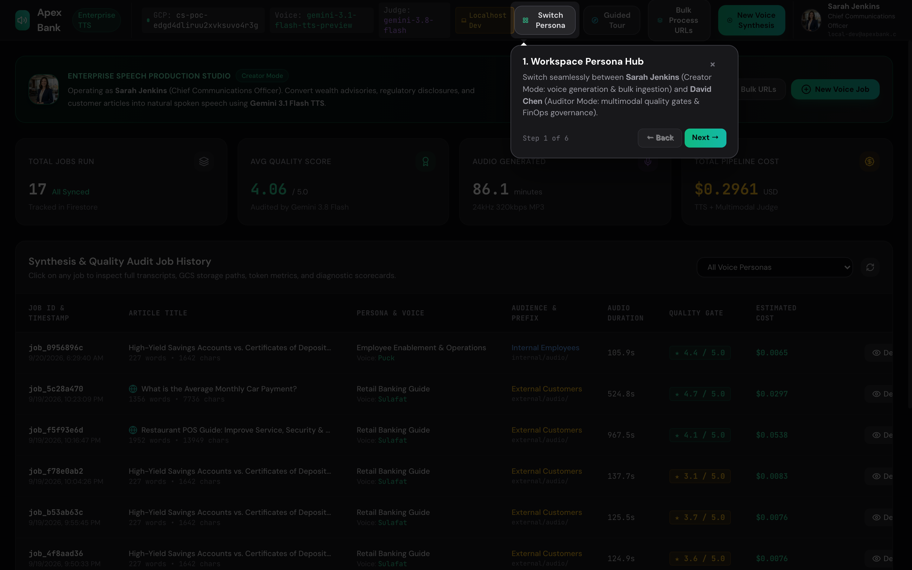

# Apex Bank Knowledge-to-Speech Studio — User Guide

> **Step-by-Step Visual Walkthrough for Financial Communications Teams, Compliance Reviewers, and Wealth Advisors.**

---

## Welcome to the Studio

The **Apex Bank Knowledge-to-Speech Studio** converts complex banking documents, regulatory compliance guides, mortgage explainers, and customer disclosures into broadcast-quality human-like audio using **Google Gemini Generative Voice (Vertex AI)**. Every generated audio asset is automatically audited by a multimodal **LLM-as-a-Judge**, persisted in serverless **Google Cloud Firestore Native**, and tagged with granular FinOps billing telemetry.

This guide walks you through every stage of using the platform across both Creator and Auditor workflows.

---

## Step 1: Banking Authentication, Localhost Development & Persona Hub

Navigate to the application portal at `http://127.0.0.1:8000` (or your deployed Google Cloud Run URL). 


### Dual Authentication Modes

The platform supports two authentication experiences depending on your execution environment:

#### 1. Zero-Config Localhost Development Mode (`http://127.0.0.1:8000`)
When running locally via `make ui` or `make ui-dev`, the studio automatically activates the **Localhost Auth Bypass**:
- Completely bypasses Google OAuth origin restrictions without requiring Google Cloud Console OAuth redirect configurations.
- Instantly issues a verified local developer session displaying a `💻 Localhost Dev` badge in the top navigation bar.
- Opens directly into the **Workspace Persona Selector Hub** without authentication friction.

#### 2. Production Enterprise Mode (Google Cloud Run)
When deployed to Google Cloud Run, access is secured via **Google Cloud Identity Platform (GCIP)** and Google Sign-In with strict enterprise domain validation (`@apexbank.com`):
- Click **Sign in with Google** to authenticate with your corporate Google Workspace account.
- Cryptographic RS256 JWT tokens are verified against Google's public JWKS keys.
- If Demo Authentication is enabled (`ENABLE_DEMO_AUTH=true`), pre-configured banking credentials can also be used.

---

### Dual Enterprise Personas & Workspace Switching

The platform is designed around two core banking stakeholders:

| User Persona | Enterprise Role | Department | Workspace Focus |
| :--- | :--- | :--- | :--- |
| **Sarah Jenkins** | Chief Communications Officer | Digital Wealth & Customer Experience | **Content Creator Studio**: Ingest articles, customize voice personas, configure director notes, run multi-turn synthesis, and review audio players. |
| **David Chen** | VP Regulatory Compliance | Bank Secrecy & AML Oversight | **Compliance & Governance Console**: Full-page executive dashboard, 4 interactive Chart.js visualizations, persona governance matrix, and flagged disclosures review. |

#### Instant Workspace Switching
You can switch between **Sarah Jenkins** (Creator) and **David Chen** (Auditor) at any time without logging out or losing work:
- Click the **"Switch Persona"** button in the top navigation bar.
- The platform immediately transitions the view, loading the appropriate workspace console while maintaining your active session.

---

### Interactive Guided Onboarding Tour
New users are greeted with a step-by-step interactive onboarding tour that highlights the platform's core workflows:
1. **Workspace Persona Hub**: Seamless switching between Sarah Jenkins (Creator) and David Chen (Auditor).
2. **Voice Synthesis Engine**: Crafting studio disclosures with Gemini 3.1 Flash TTS preview.
3. **Bulk Article Extraction**: Batch URL scraping and sequential audio generation.
4. **Enterprise Audio Studio**: Throughput metrics, quality tracking, and FinOps telemetry.
5. **Audio Registry & Playback**: Auditing 24kHz streams and Gemini 3.8 Flash Multimodal Quality Scorecards.
6. **Replay on Demand**: Persistent database tracking ensures the tour auto-prompts only once upon first login, while remaining relaunchable on demand via the **Guided Tour** button in the navigation bar.



---

## Step 2: Exploring the Creator Studio Dashboard & Ingesting Content

Operating as **Sarah Jenkins**, you enter the primary Studio workspace. The top metrics bar provides real-time visibility into enterprise activity: **Total Jobs**, **Cumulative Cost (USD)**, **Generated Audio Minutes**, and **Average Quality Score**.


### Content Ingestion Methods

You can supply content to the studio using three methods:

#### Method A: Direct Text / Markdown Input
Paste the raw text of your knowledge article, customer advisory, or intranet announcement directly into the **Article Transcript** editor.

#### Method B: One-Click Sample Banking Disclosures (with Director Tuning)
Click the **Load Sample Disclosures** button below the text area. This immediately loads:
1. A realistic multi-page financial guide: *"High-Yield Savings Accounts vs. Certificates of Deposit (CDs): A Financial Guide for Retail Banking Customers"*, complete with APY/APR disclosures, liquidity rules, and FDIC insurance notices.
2. Injected **Director Notes & Vocal Delivery Directives** tuned for clean acronym enunciation:
   - Initialism pronunciations: *"F-D-I-C, A-P-Y, C-D, K-Y-C, B-S-A"*
   - Natural pacing: *"Insert distinct 0.5-second pauses between instructional sections."*
   - Vocal style: *"Deliver speech with warmth, authority, and conversational clarity without robotic monotone."*

#### Method C: Single Web URL Ingestion
Enter any public or internal banking web URL into the URL field and click **Extract Content**. The built-in HTML extractor automatically strips:
- Website navigation bars and header menus
- Cookie consent banners and privacy policy footers
- Advertisement containers and social sharing sidebars
- Dynamic scripts and tracking pixels

The clean article body is extracted and populated directly into the transcript editor.

---

## Step 3: Selecting a Voice Persona & Customizing Vocal Style

On the right side of the studio dashboard, select the voice persona that matches your target audience and regulatory context.

### The 5 Pre-Configured Banking Personas

| Persona Name | Target Audience | Gemini Voice | Recommended Use Case |
| :--- | :--- | :--- | :--- |
| **1. Retail Banking Guide** | External Customers | `Sulafat` | Mortgage explainers, CD rate guides, retail branch FAQs |
| **2. Wealth & Market Advisor** | External Customers | `Charon` | High-net-worth briefings, market analysis, equities advisories |
| **3. Regulatory & Policy Officer** | Internal Employees | `Kore` | BSA/AML bulletins, KYC updates, compliance SOPs |
| **4. Employee Enablement & Ops** | Internal Employees | `Puck` | Branch teller software guides, onboarding procedures |
| **5. Fraud & Security Alert** | Both (All Audiences) | `Schedar` | Phishing advisories, urgent fraud mitigation warnings |

### Custom Director Directives

Use the **Director Notes & Vocal Delivery Directives** field to instruct the generative model on vocal characteristics without writing brittle SSML XML tags:

* *Pacing Directive*: `"Deliver this guidance with an unhurried, reassuring cadence. Insert distinct 0.5-second pauses between numbered sections."`
* *Compliance Directive*: `"Adopt a formal, authoritative tone. Emphasize mandatory reporting deadlines and supervisory escalation paths."`
* *Empathy Directive*: `"Speak with warmth and reassurance when explaining hardship options and loan modification relief."`

Once configured, click the glowing teal **Synthesize Speech & Audit Quality** button.

---

## Step 4: Monitoring Live Multi-Turn Synthesis & 5-Stage Stepper

Submitting a job immediately opens the live progress drawer with zero lag. The real-time visual stepper tracks the job through 5 distinct pipeline stages:


### The 5 Live Stepper Stages

```
[1. CHUNKING] ──> [2. SYNTHESIZING] ──> [3. STITCHING] ──> [4. UPLOADING] ──> [5. EVALUATING]
```

1. **Step 1: Chunking (`CHUNKING`)**
   - Articles exceeding ~400 words are partitioned along sentence boundaries (`.?!\n\n`).
   - Bullet points, headings, and financial tables are preserved without mid-sentence truncation.
2. **Step 2: Generative Speech (`SYNTHESIZING`)**
   - Synthesized using `gemini-3.1-flash-tts-preview` in `us-central1`.
   - On multi-chunk articles, active turn pill indicators (`Turn 1 of 2`, `Turn 2 of 2`) display real-time progress.
   - Turns $2 \dots N$ inject **Audio Continuity Directives** to maintain exact pitch floor, volume, and cadence.
3. **Step 3: DSP Mastering & Stitching (`STITCHING`)**
   - **RMS Loudness Normalization**: Leveling to 3000 RMS prevents inter-turn volume jumps.
   - **Micro-Fading**: 40ms raised-cosine fades eliminate boundary DC-offset clicks.
   - **Turn Concatenation**: Spliced with **300ms natural silence pauses**.
   - **In-Memory MP3 Transcoding**: Encoded via `lameenc` to broadcast-standard MP3 (24kHz mono @ 320kbps).
4. **Step 4: Cloud Storage Upload (`UPLOADING`)**
   - Uploaded to Google Cloud Storage under audience prefix paths: `external/audio/`, `internal/audio/`, or `shared/audio/`.
   - Generates a secure, 60-minute time-limited V4 Signed URL for streaming.
5. **Step 5: Multimodal Quality Audit (`EVALUATING`)**
   - Direct zero-download evaluation via Gemini 3.8 Flash (`types.Part.from_uri()`).

---

## Step 5: Interactive Audio Playback & Seeking

Once synthesis completes, the in-browser broadcast player unlocks immediately:


### Player Features
* **Interactive Waveform Scrubber**: Click or drag anywhere along the timeline to seek instantly, supported by HTTP `Accept-Ranges: bytes` streaming directly from Cloud Storage.
* **Playback Speed Selector**: Toggle between **1.0x**, **1.25x**, and **1.5x** speeds.
* **Volume Modulation**: Smooth real-time volume slider.
* **Direct MP3 Download**: Download the mastered 320kbps `.mp3` asset directly to your workstation for distribution to CMS, podcast channels, or internal intranets.

---

## Step 6: Auditing the Multimodal LLM-as-a-Judge Scorecard

Directly below the audio player is the **Multimodal Quality Scorecard**, generated by **Gemini 3.8 Flash** evaluating the audio file directly from Cloud Storage:

### The 6-Dimension Rubric

| Rubric Dimension | Weight | Target Standard |
| :--- | :---: | :--- |
| **1. Script Adherence & Accuracy** | **25%** | Verbatim accuracy against source text; checks for dropped parentheticals, word omissions, or hallucinations. |
| **2. Naturalness & Inflection** | **20%** | Human pitch dynamics and natural sentence transitions versus robotic monotone. |
| **3. Pacing & Breathing** | **15%** | Measured rhetorical pauses between headings, lists, and key financial percentages. |
| **4. Tone Congruence** | **15%** | Alignment with assigned persona (e.g. welcoming retail advisor vs. strict compliance officer). |
| **5. Pronunciation & Jargon** | **15%** | 100% accurate pronunciation of banking acronyms (*FDIC, APY, APR, ACH, EFT, KYC, BSA, AML, HELOC*). |
| **6. Acoustic Quality** | **10%** | Studio-grade broadcast clarity; zero clipping, buzzing, or room reverberation. |

### Compliance Gate Threshold
* **Overall Score $\ge$ 4.0 / 5.0**: Displays the emerald **`PASSED RUBRIC`** badge, certifying the audio meets enterprise standards.
* **Overall Score < 4.0 / 5.0**: Displays the amber **`NEEDS REVISION`** badge, flagging the asset for compliance remediation.

### Concrete Actionable Feedback
The scorecard provides verbatim rationale and specific, actionable recommendations for prompt tuning (e.g., *"Pronounce 'FDIC' cleanly as separate letters rather than blended; maintain the warm pacing in Section 2"*).

---

## Step 7: Executive Compliance & Governance Dashboard (David Chen Persona)

When switching to **David Chen** (VP Regulatory Compliance), the application unlocks a dedicated, full-page **Executive Governance Dashboard**:

```
┌─────────────────────────────────────────────────────────────────────────────┐
│                       DAVID CHEN • COMPLIANCE CONSOLE                       │
│  [📊 Executive Governance Dashboard]       [📋 Disclosure Audio Registry]   │
└─────────────────────────────────────────────────────────────────────────────┘
```

The Auditor can toggle between:
1. **Executive Governance Dashboard**: Aggregate compliance metrics, 4 Chart.js visualizations, persona breakdown, and unit economics.
2. **Disclosure Audio Registry**: Searchable, filterable ledger of all generated audio assets with direct access to scorecards.

---

### 1. Top-Line KPI Metric Cards
* **Total FinOps Spend**: Real-time cumulative USD expenditure with breakdown between Speech Generation and Multimodal Auditing.
* **Token Volume**: Total token throughput across context text, synthesized audio streams, and multimodal evaluation.
* **Compliance Quality Gate**: Percentage of generated assets meeting or exceeding the $\ge 4.0$ benchmark.
* **Audited Audio Runtime**: Total cumulative broadcast audio runtime in minutes, alongside the platform mean score.

---

### 2. The 4 Interactive Chart.js Visualizations

#### Chart 1: Multimodal Quality Rubric Radar (`chartRubricRadar`)
Visualizes organizational quality across the 6 rubric dimensions on a spider radar chart against a distinct **4.0 Regulatory Quality Gate** circle. Highlights top-performing dimensions (e.g. *Tone Congruence: 4.9*) and dimensions requiring prompt attention (e.g. *Pronunciation & Jargon: 4.3*).

#### Chart 2: FinOps Pipeline Cost Allocation Donut (`chartFinopsSplit`)
Displays the exact cost distribution between:
- **Gemini 3.1 Flash Speech Generation** (~85%–90%)
- **Gemini 3.8 Flash Multimodal Quality Auditing** (~10%–15%)
Directly calculates the **Auditing Overhead Ratio** to verify governance cost efficiency.

#### Chart 3: Banking Persona Quality Benchmarks Bar Chart (`chartPersonaBars`)
Compares average multimodal quality scores across all 5 banking personas with a horizontal threshold line at 4.0, ensuring every voice meets enterprise standards.

#### Chart 4: Token Volume Modality Stack Bar Chart (`chartTokenStack`)
Breaks down token consumption by data modality:
- **Input Text Tokens** (article text and director instructions)
- **Audio Output Tokens** (raw generative audio waveforms)
- **Judge Evaluation Tokens** (multimodal audio review and structured evaluation)

---

### 3. Banking Persona Governance Matrix
An aggregate data table displaying per-persona metrics:
- **Volume**: Number of generated disclosures.
- **Pass Rate**: Percentage of runs achieving $\ge 4.0$.
- **Average Score**: Mean overall score across all runs.
- **FinOps Spend**: Total USD expenditure per persona.
- **Token Volume**: Total tokens consumed.
- **Regulatory Status**: Color-coded badges (`Compliant` vs `Under Review`).

---

### 4. Enterprise Unit Economics & Cloud Specs
* **Cost per Audio Minute**: **\$0.0034 / min**
* **Cost per Audited Disclosure**: **\$0.0182 / disclosure**
* **Auditor Overhead Ratio**: Typically **~10% to 15%** of total pipeline cost
* **Persistence Engine**: Google Cloud Firestore Native (`tts-jobs`)
* **Audio Retention**: Automated 30-day GCS lifecycle purge rule

---

### 5. Flagged Disclosures Action Center
A specialized triage queue that automatically surfaces any disclosure scoring below 4.0:
- Displays the article title, persona, score, and failure reason.
- Provides a **1-click "Inspect Scorecard"** button that immediately loads the audio player, 6-dimension scores, and critique for remediation.

---

## Step 8: Slide-Over FinOps & Compliance Inspector

Accessible from the top navigation bar at any time via the **⚙️ Enterprise Specs** button:


### Real-Time Telemetry & Token Accounting
* **Granular USD Costing**: Exact pricing down to six decimal places ($0.006869).
* **Token Breakdown**: Explicit accounting of prompt text tokens, synthesized audio tokens, and judge evaluation tokens.
* **Enterprise Security Affirmations**:
  * **Zero Data Retention**: Confirms customer text and audio are never used for model training.
  * **Storage Encryption**: Displays GCS encryption standards (**AES-256 at-rest** and **TLS 1.3 in-transit**).
  * **IAM Prefix Routing**: Confirms audience prefix isolation.

---

## Step 9: Batch Ingestion with Bulk URLs

For processing multiple regulatory bulletins, news releases, or mortgage rate sheets simultaneously, switch to the **Bulk URL Ingestion** tab.


### How to Run a Batch Job:
1. Enter one or more public or intranet URLs into the input box (or click **Load Sample Financial URLs**).
2. Select your target persona.
3. Click **Enqueue Articles for Batch Synthesis**.
4. The background queue processes each article sequentially:
   - **Extracting**: Content is scraped, parsed, and scrubbed of boilerplate.
   - **Synthesizing**: Gemini Generative Voice creates the audio asset.
   - **Auditing**: The multimodal judge generates a scorecard.
   - **Completed**: The record is saved and appears immediately in the history table.

---

## Step 10: Serverless Cloud Firestore Data Continuity & Job Management

All speech synthesis jobs, audio GCS references, token telemetry, and quality scorecards are persisted in **Google Cloud Firestore Native Mode** (`tts-jobs` database, `tts_jobs` collection):

- **Data Continuity**: Deploying new revisions or restarting Cloud Run containers does **not** wipe out historical records.
- **Offline Resiliency**: In offline test environments where `USE_FIRESTORE=false`, the repository seamlessly falls back to a local SQLite database (`data/tts_jobs.db`).
- **Data Migration**: Existing local SQLite records can be migrated to Cloud Firestore at any time via:
  ```bash
  make migrate-data
  ```

### Job History Table Features:
* **Persona Filtering**: Filter past runs by persona to compare performance across departments.
* **Interactive Pagination**: Browse jobs with configurable page sizes (5, 10, 20, 50 rows per page; default 10) and numbered page navigation.
* **Score Badges**: Color-coded badges highlight passing scores ($\ge 4.0$) versus assets needing revision.
* **1-Click Retry**: Click **🔄 Retry** to re-synthesize an article with updated director notes or an alternate voice persona.
* **Job Deletion**: Click **🗑 Delete** to permanently remove the database record and purge any local audio cache files.

---

## Quick Reference Summary

```
┌───────────────────────────────────┬─────────────────────────────────────────────────────────────┐
│ Question                          │ Answer / Action                                             │
├───────────────────────────────────┼─────────────────────────────────────────────────────────────┤
│ How do I launch the app locally?  │ make ui-dev (or make ui)                                    │
│ What is the local URL?            │ http://127.0.0.1:8000 (Localhost Auth Bypass auto-active)   │
│ How do I switch personas?         │ Click "Switch Workspace" in the top navbar                  │
│ Who is the Content Creator?       │ Sarah Jenkins (Chief Communications Officer)                │
│ Who is the Compliance Auditor?    │ David Chen (VP Regulatory Compliance)                       │
│ Where is job data persisted?      │ Google Cloud Firestore Native (tts-jobs database)           │
│ How do I migrate local SQLite?    │ make migrate-data                                           │
│ Where is audio stored?            │ Google Cloud Storage (gs://[BUCKET]/[prefix]/[job_id].mp3)   │
│ What is the average audio cost?   │ ~$0.0034 per audio minute (~$0.0182 per full disclosure)    │
│ Is audio downloaded by the judge? │ No, evaluated via zero-download GCS URI (Part.from_uri)     │
│ Are customer models trained?      │ No, zero data retention for model training is guaranteed    │
│ How do I run automated tests?     │ make test (75 automated unit and integration tests)         │
└───────────────────────────────────┴─────────────────────────────────────────────────────────────┘
```
