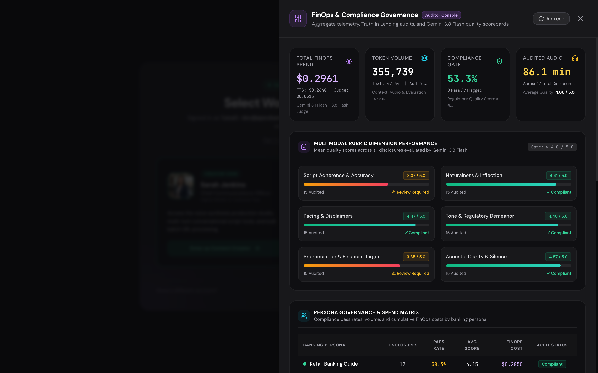
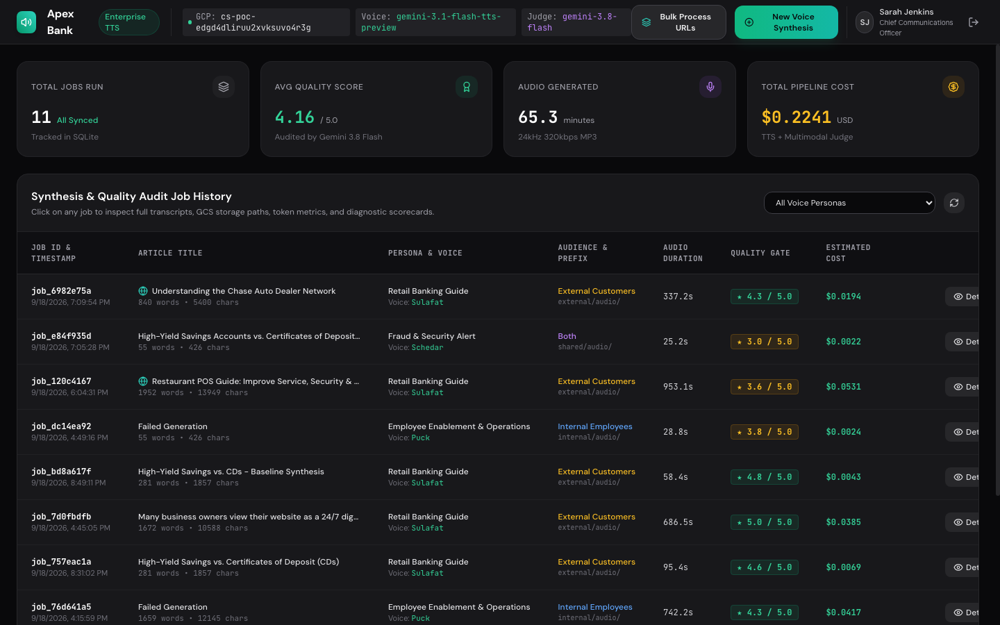
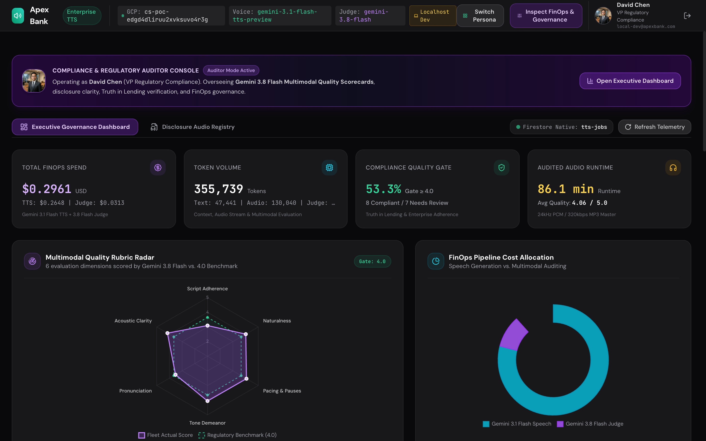
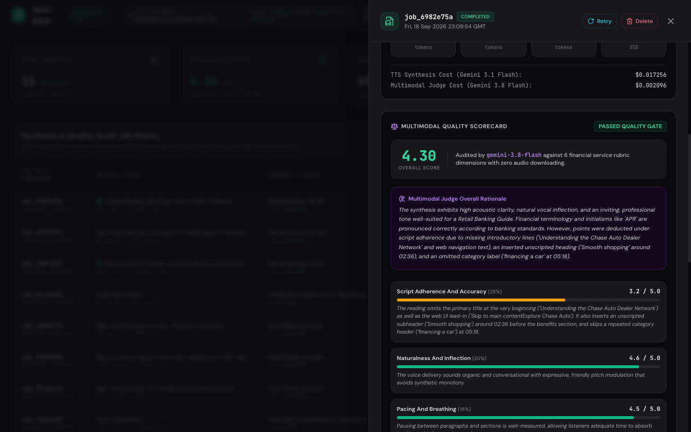
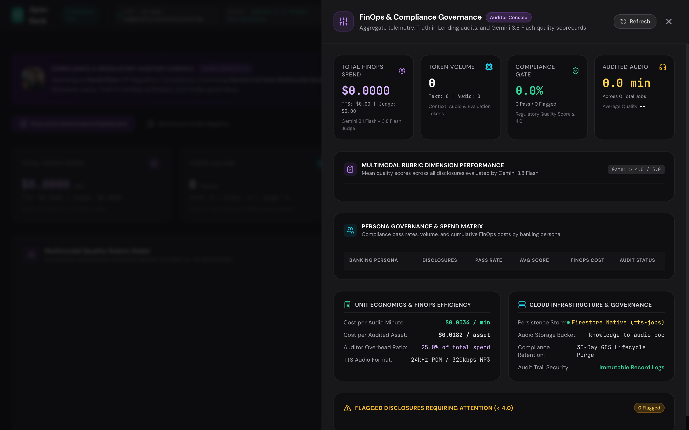
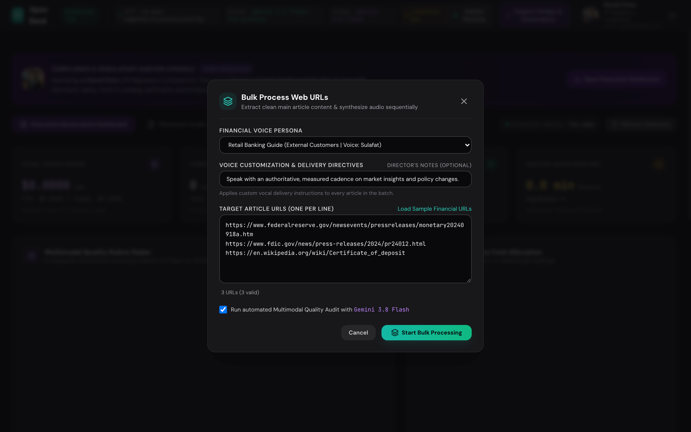

# Apex Bank Knowledge-to-Speech Studio — User Guide

> **Step-by-Step Visual Walkthrough for Financial Communications Teams, Compliance Reviewers, and Wealth Advisors.**

---

## Welcome to the Studio

The **Apex Bank Knowledge-to-Speech Studio** converts complex banking documents, regulatory compliance guides, mortgage explainers, and customer disclosures into broadcast-quality human-like audio using **Google Gemini Generative Voice**. Every generated audio asset is automatically audited by a multimodal **LLM-as-a-Judge** and tagged with granular FinOps billing telemetry.

This guide walks you through every stage of using the platform.

---

## Step 1: Secure Banking Login & Role Selection

Navigate to the application portal at `http://localhost:8000`. You will be presented with the banking authentication modal.



### User Personas & Demo Accounts

The platform includes two pre-configured enterprise roles:

| User | Role | Department | Default Persona | Credentials |
| :--- | :--- | :--- | :--- | :--- |
| **Sarah Jenkins** | Chief Communications Officer | Digital Wealth & Customer Experience | *Retail Banking Guide* | `admin@apexbank.com` / `demo1234` |
| **David Chen** | VP Regulatory Compliance | Bank Secrecy & AML Oversight | *Regulatory & Policy Officer* | `auditor@apexbank.com` / `demo1234` |

1. Click on either the **Sarah Jenkins** or **David Chen** quick-fill button, or enter your corporate banking credentials.
2. Click **Authenticate Banking Session**.
3. Upon authentication, a secure session token is issued, unlocking the main studio.

---

## Step 2: Exploring the Studio Dashboard & Ingesting Knowledge Articles

Once authenticated, you enter the primary Studio workspace. The top metrics bar provides real-time visibility into enterprise usage: **Total Jobs**, **Cumulative Cost (USD)**, **Generated Audio Minutes**, and **Average Quality Score**.



### Ways to Ingest Content

You can supply text to the studio using three methods:

#### Method A: Direct Text / Markdown Input
Paste the raw text of your knowledge article, customer advisory, or intranet announcement directly into the **Article Transcript** editor.

#### Method B: One-Click Sample Banking Disclosures
Click the **Load Sample Disclosures** button under the text area. This loads a realistic multi-page financial guide (*"Mortgage Rate & Refinance Guidance Advisory"*) complete with interest rates, APY/APR disclosures, and FDIC insurance notices.

#### Method C: Single Web URL Ingestion
Enter any public or internal banking web URL into the URL field. The extractor automatically strips:
* Website navigation bars and headers
* Cookie consent banners and privacy policy footers
* Advertisement and social sharing sidebars
* Scripts and dynamic tracking pixels

The clean article body is extracted and populated directly into the transcript editor.

---

## Step 3: Selecting a Voice Persona & Customizing Vocal Style

On the right side of the studio dashboard, select the voice persona that matches your target audience and regulatory context.

### The 5 Pre-Configured Banking Personas

```
┌───────────────────────────────────┬─────────────────────┬──────────────┬────────────────────────────────────────────────────────┐
│ Persona Name                      │ Target Audience     │ Gemini Voice │ Recommended Use Case                                   │
├───────────────────────────────────┼─────────────────────┼──────────────┼────────────────────────────────────────────────────────┤
│ 1. Retail Banking Guide           │ External Customers  │ Sulafat      │ Mortgage explainers, CD rate guides, retail branch FAQs│
│ 2. Wealth & Market Advisor        │ External Customers  │ Charon       │ High-net-worth briefings, market analysis, equities    │
│ 3. Regulatory & Policy Officer    │ Internal Employees  │ Kore         │ BSA/AML bulletins, KYC updates, compliance SOPs        │
│ 4. Employee Enablement & Ops      │ Internal Employees  │ Puck         │ Branch teller software guides, onboarding procedures   │
│ 5. Fraud & Security Alert         │ Both (All Audiences)│ Schedar      │ Phishing advisories, urgent fraud mitigation warnings  │
└───────────────────────────────────┴─────────────────────┴──────────────┴────────────────────────────────────────────────────────┘
```

### Adding Custom Director Directives

Use the **Director Notes & Vocal Delivery Directives** field to customize pacing, tone, and emphasis without touching code or SSML:

* *Example Pacing Directive*: `"Deliver this guidance with an unhurried, reassuring cadence. Insert distinct 0.5-second pauses between instructional steps."`
* *Example Compliance Directive*: `"Adopt a formal, authoritative tone. Firmly emphasize mandatory reporting deadlines and supervisory escalation paths."`
* *Example Empathy Directive*: `"Speak with warmth and reassurance when discussing hardship options and payment relief assistance."`

Once configured, click the glowing teal **Synthesize Speech & Audit Quality** button.

---

## Step 4: Monitoring Live Synthesis & DSP Mastering

The studio immediately transitions to the active processing view. The live stepper tracks the progress of the multi-turn synthesis pipeline:



### Pipeline Checkpoints

1. **Step 1: Chunking**
   * Long articles exceeding 400 words are partitioned into complete-sentence units.
   * Sentences and bullet points are preserved without truncation.
2. **Step 2: Synthesizing**
   * The Gemini TTS model (`gemini-3.1-flash-tts-preview`) generates native audio waveforms.
   * On turns $2 \dots N$, **Audio Continuity Directives** ensure consistent pitch floor, volume, and speaking energy across turn boundaries.
3. **Step 3: DSP Mastering & Stitching**
   * **RMS Loudness Normalization**: Leveling to 3000 RMS prevents volume jumps.
   * **Micro-Fading**: 40ms raised-cosine fades eliminate DC-offset clicks.
   * **Stitching**: Concatenates chunks with natural 300ms silence pauses.
   * **Transcoding**: Transcoded via `ffmpeg` to broadcast-standard MP3 (24kHz mono @ 320kbps).
4. **Step 4: GCS Audience Upload**
   * Uploaded to Google Cloud Storage under audience prefix keys (`external/audio/`, `internal/audio/`, or `shared/audio/`).
   * A 60-minute V4 Signed URL is created for playback.
5. **Step 5: Multimodal Quality Audit**
   * The audio URI is dispatched directly to the Gemini Multimodal Judge.

---

## Step 5: Interactive Audio Playback & Seeking

Once synthesis completes, the in-browser broadcast player unlocks immediately:



### Player Features
* **Waveform Audio Scrubber**: Click or drag anywhere along the timeline to seek. Supported by HTTP `Accept-Ranges: bytes` streaming directly from Cloud Storage.
* **Playback Rate**: Toggle between **1.0x**, **1.25x**, and **1.5x** speeds.
* **Volume Slider**: Real-time volume modulation.
* **Download Broadcast MP3**: Download the high-bitrate mastered `.mp3` asset directly to your workstation for distribution to CMS, podcast feeds, or internal intranets.

---

## Step 6: Auditing the Multimodal LLM-as-a-Judge Scorecard

Directly below the audio player is the **Multimodal LLM Quality Scorecard**, generated by **Gemini 3.8 Flash** listening directly to the GCS audio file:

### The 6-Dimension Rubric

| Rubric Dimension | Weight | Target Standard |
| :--- | :---: | :--- |
| **1. Script Adherence & Accuracy** | **25%** | Verbatim accuracy against the source text; checks for any missed, duplicated, or misread words. |
| **2. Naturalness & Inflection** | **20%** | Organic human sentence transitions, dynamic pitch inflection, and conversational warmth. |
| **3. Pacing & Breathing** | **15%** | Natural breathing pauses between headings, lists, and numerical disclosures. |
| **4. Tone Congruence** | **15%** | Strict alignment with the selected persona (e.g. authoritative compliance vs. welcoming retail guide). |
| **5. Pronunciation & Jargon** | **15%** | 100% accurate pronunciation of banking acronyms (*FDIC, APY, APR, ACH, EFT, KYC, BSA, AML, HELOC*). |
| **6. Acoustic Quality** | **10%** | Broadcast clarity; zero metallic buzzing, clipping, or background noise. |

### Pass / Fail Threshold
* **Overall Score $\ge$ 4.0 / 5.0**: Displays the emerald **`PASSED RUBRIC`** badge, certifying the asset is enterprise-ready.
* **Overall Score < 4.0 / 5.0**: Flags the job as **`NEEDS REVISION`** with specific critique.

### Actionable Feedback
The auditor card provides concrete notes on what the model did well (e.g. *"Acronym 'HELOC' correctly pronounced as 'hee-lock'"*) and specific recommendations for prompt tuning (e.g. *"Increase pause after Section 2 heading"*).

---

## Step 7: Inspecting Unit Economics & FinOps Governance

Click the **⚙️ Enterprise Specs** button in the top navigation bar to open the slide-over **Enterprise FinOps & Compliance Inspector**.



### Real-Time Cost & Token Accounting

The inspector reveals the true cloud unit economics of the generated asset:
* **Total Job Cost**: Typically **\$0.003 to \$0.005** per complete multi-minute article.
* **Token Breakdown**:
  * **Input Text Tokens**: Cost of the prompt and article text (~$0.10 / 1M tokens).
  * **Audio Output Tokens**: Cost of synthesized audio waveforms (~$2.00 / 1M tokens).
  * **Judge Input Tokens**: Cost of feeding reference text and multimodal audio to the judge (~$0.15 / 1M tokens).
  * **Judge Output Tokens**: Cost of generating the evaluation JSON scorecard (~$0.60 / 1M tokens).

### Enterprise Security & Compliance Badges
* **Zero Data Retention**: Confirms customer text and audio are **never used to train foundation models**.
* **Storage Encryption**: Displays GCS bucket encryption standards (**AES-256 at-rest** and **TLS 1.3 in-transit**).
* **IAM CEL Condition**: Confirms the active prefix path enforced for audience segregation.

---

## Step 8: Batch Ingestion with Bulk URLs

For processing multiple regulatory bulletins, news releases, or mortgage rate sheets simultaneously, use the **Bulk URL Ingestion** tab.



### How to Run a Batch Job:
1. Enter one or more public or intranet URLs into the **Input New Articles** box (or click **Load Sample Financial URLs**).
2. Select your target persona.
3. Click **Enqueue Articles for Batch Synthesis**.
4. The background queue processes each article sequentially:
   * **Extracting**: Content is scraped, parsed, and scrubbed of boilerplate.
   * **Synthesizing**: Gemini Generative Voice creates the audio asset.
   * **Auditing**: The multimodal judge generates a scorecard.
   * **Completed**: The job record is saved and appears in the history table.

---

## Step 9: Reviewing Past Jobs, Retrying & Exporting

At the bottom of the studio screen is the **Job History Table**:

* **Persona Filtering**: Filter past runs by persona to compare voice performance.
* **Interactive Pagination**: Browse synthesis jobs using configurable page sizes (5, 10, 20, 50 rows per page; default 10) with numeric page navigation and boundary controls.
* **Score Badges**: Color-coded badges highlight passing scores ($\ge 4.0$) versus assets needing revision.
* **1-Click Retry**: Click the **🔄 Retry** button on any job to re-synthesize the article with updated director notes or an alternate voice persona.
* **Delete Job**: Click the **🗑 Delete** icon to permanently remove the database record and purge any local audio cache files.

---

## Quick Reference Summary

```
┌─────────────────────────┬─────────────────────────────────────────────────────────────┐
│ Question                │ Answer / Action                                             │
├─────────────────────────┼─────────────────────────────────────────────────────────────┤
│ How do I run the app?   │ make ui-dev (or make ui)                                    │
│ What is the login?      │ admin@apexbank.com / demo1234 (Sarah Jenkins)               │
│ Where is audio saved?   │ Google Cloud Storage (gs://[BUCKET]/[prefix]/[job_id].mp3)   │
│ Can I seek in audio?    │ Yes, HTTP byte-range scrubbing is fully supported.          │
│ How much does it cost?  │ Average $0.0036 per generated article.                      │
│ Are models trained?     │ No, customer data is never used for model training.         │
└─────────────────────────┴─────────────────────────────────────────────────────────────┘
```
